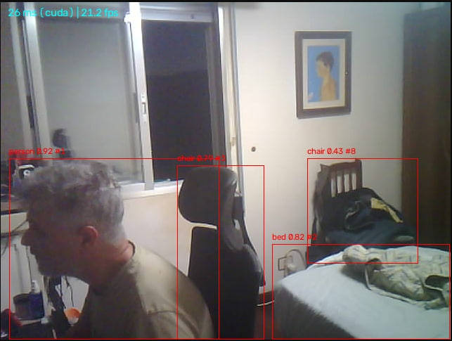
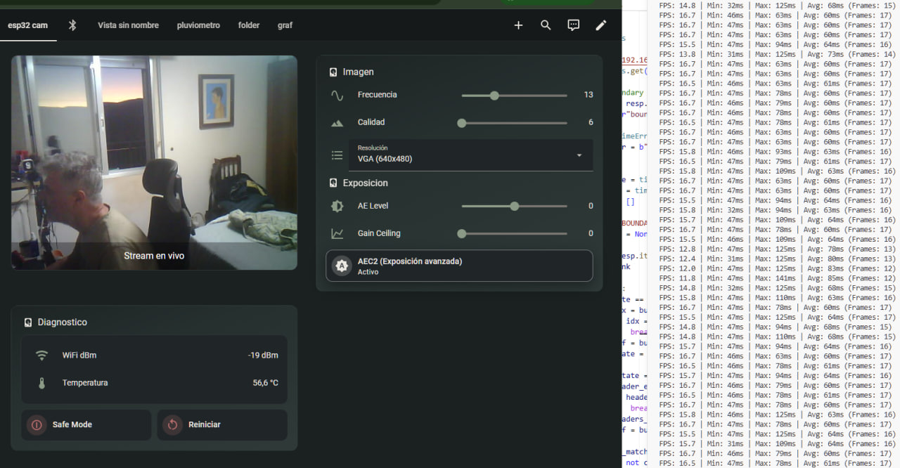
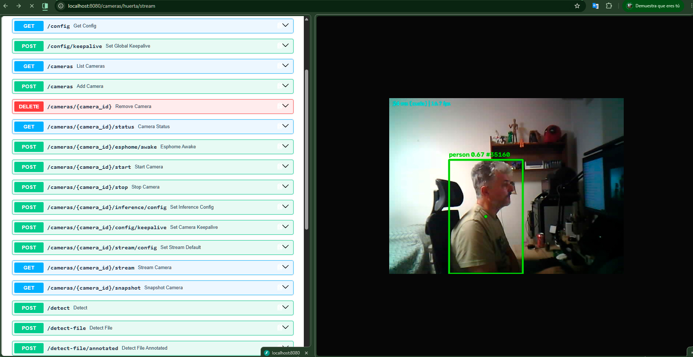
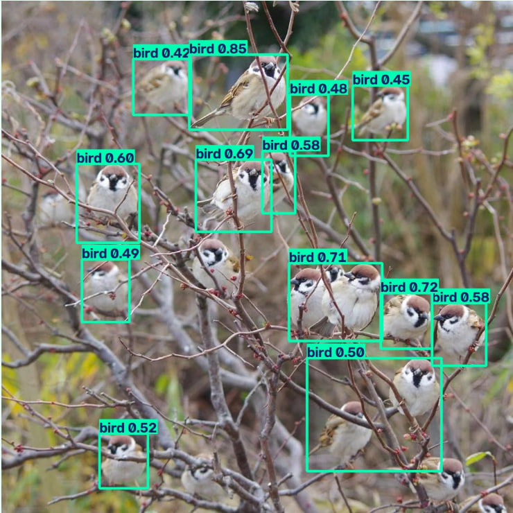

# smart-sentry

Vigilancia con visión artificial para un nodo de cámara a baterías: una placa
**ESP32-S3-CAM** con PIR y deep sleep envía vídeo a un servicio **YOLO** que
hace la detección una sola vez y la reparte a Home Assistant, el navegador o
VLC.



Home assistant con los controles de la camara de esphome



Swagger y stream 


El repositorio tiene **dos mitades independientes** que se comunican por red:

| Carpeta | Qué es | Lenguaje |
| --- | --- | --- |
| [`esphome/`](esphome/) | Firmware de las placas ESP32-S3-CAM: cámara exterior con PIR + deep sleep, cámara siempre encendida y torreta pan/tilt | YAML de ESPHome + componente C++ parcheado |
| [`detect/`](detect/) | Servicio Python (FastAPI) que hace la inferencia YOLO sobre el vídeo de esas cámaras y lo multiplexa hacia N clientes. | Python |

---

## Cómo encajan

La placa `huerta` ofrece dos canales:

- **Stream MJPEG por HTTP** (`:8080`) y snapshot (`:8081`) — el vídeo.
- **API nativa de ESPHome** (`:6053`) — control y estado. Expone un
  `binary_sensor` `awake`: `ON` = despierta (PIR), `OFF` = a punto de dormir.

El servicio de `detect/` consume los dos: el vídeo por HTTP (con `requests` +
OpenCV) y el estado por la API nativa (con `aioesphomeapi` y la
`api.encryption.key` del YAML de la placa). Con eso arranca y para la
inferencia siguiendo el PIR real, sin polling.

Idea central: **una sola conexión al ESP32, una sola inferencia, N clientes**.
El firmware `esp32_camera_web_server` solo admite un consumidor de stream a la
vez, así que el servicio Python es el único que abre conexión contra la placa
y hace de multiplexor.

```
ESP32-S3-CAM (huerta)                 detect/ (FastAPI, 1 proceso)          Clientes
─────────────────────                 ───────────────────────────          ────────
stream MJPEG  :8080  ──HTTP stream──►  hilo lector → cola → hilo YOLO  ──►  Home Assistant
API nativa    :6053  ──awake on/off──►  EsphomeController → start/stop      Navegador / VLC
        ▲                                          │
        │                                          └→ hilo escritor → clips/*.mp4
        │                                                    ▲              │
        └──────  POST /cameras/huerta/esphome/awake          │        GET /recordings
                 (al obtener IP)                     retención (días + GB)  ──► Home Assistant
```

La rama de abajo es la grabación: el mismo JPEG que va al stream se encola hacia
un hilo escritor que lo pasa a MP4 (H.264), y los clips se sirven por HTTP para
que Home Assistant los liste y los reproduzca desde la otra máquina.

### Arranque rápido tras despertar (el webhook `esphome/awake`)

La placa duerme casi todo el tiempo, así que cada vez que el PIR la despierta
tiene que rehacer toda la pila de red desde cero. El primer coste es fijo e
inevitable: **reasociar el WiFi y coger IP cuesta unos 3-4 s**. A eso hay que
sumarle el tiempo que tarde el servicio de `detect/` en reconectar su API
nativa y volver a suscribirse al `awake`.

Ese segundo tramo es el que se puede recortar. Si se deja que `aioesphomeapi`
lo resuelva "solo" —descubrimiento mDNS de la placa más su reconexión con
backoff exponencial—, va de **1 s a 60 s**: el servicio no
sabe que la placa ha vuelto y solo lo descubre en su siguiente reintento
programado. En una ventana de vigilia de pocos segundos, eso es perder el
evento entero.

Para eliminar ese tramo, la placa **avisa activamente** en cuanto tiene red:

1. En `wifi.on_connect`, el ESP32 hace un `POST` a la URL configurada en
   `server_awake_url` (p. ej.
   `http://<host-del-servicio>:8080/cameras/huerta/esphome/awake`), antes
   incluso de que el servicio se haya enterado de que la placa existe.
    
   nota: Si `server_awake_url` se deja **vacío**, ESPHome no hace la llamada y se
   vuelve al descubrimiento pasivo de arriba.
2. Ese endpoint llama a `EsphomeController.notify_awake()`, que marca un
   `_wake_event` de forma *thread-safe* (`call_soon_threadsafe`).
3. El bucle de reconexión no hace polling: espera en paralelo a
   `_try_connect_once()` **y** a `_wake_event`, y toma lo primero que termine.
   El aviso salta la espera pasiva de seguridad (`safety_retry_sec`, 30 s).
4. Si justo había un intento de conexión "en vuelo" contra la placa aún
   dormida, `_wake_event` lo **cancela** en vez de esperar a que agote su
   timeout (por eso cada intento está acotado a `connect_attempt_timeout_sec`,
   1 s, en lugar de los ~10 s por defecto de la librería) y reintenta ya.

Resultado: la API nativa queda suscrita y con el `awake` fluyendo **~0,1 s
después de que la placa tenga IP**, sin depender de mDNS ni del backoff interno
de la librería. El tiempo total "PIR dispara → sistema operativo" lo domina
entonces la reconexión del WiFi (esos 3-4 s), no el software.

```
[21:24:02.960][D][main:538]: WiFi connected
[21:24:02.989][D][http_request.idf:044]: Received response header, name: content-length, value: 11
[21:24:03.058][D][api.connection:2461]: aioesphomeapi (192.168.1.171): connected
[21:24:52.977][D][api.connection:2461]: Home Assistant 2026.6.4 (192.168.1.42): connected
```

---

## Estado y hoja de ruta

**Ahora mismo** el servicio *ve* y *recuerda*: corre YOLO sobre cada frame,
dibuja las cajas de detección (con clase, confianza y `track_id`) sobre el
stream que sirve a los clientes, y **graba clips MP4** de lo que pasa, con unos
segundos de vídeo anterior al disparo. Todavía no actúa sobre el mundo físico.

La grabación vive en el servicio Python y no en Home Assistant porque HA corre
en otra máquina: aquí están las detecciones (así que el clip puede empezar
*antes* de que aparezca el bicho y saber qué se vio), y la retención por días y
por GB. HA se limita a listar los clips y reproducirlos por HTTP. Ver
[`detect/docs/GRABACION.md`](detect/docs/GRABACION.md).

**Siguiente paso — mover servos.** La API nativa de ESPHome no es solo para
leer estado: `ServoTracker` (`detect/servo_tracker.py`) ya llama al servicio
`set_servo_position` del YAML vía `EsphomeController.call_service()` si la
placa lo expone. La idea es cerrar el bucle:
el hilo de proceso calcula el centro del objetivo detectado y, si todo va bien,
manda al ESP32 la corrección de pan/tilt para que la **cámara persiga** a lo
que se mueve por la huerta.

**Meta final — el espantapájaros definitivo.(water-tower-defense)** Un nodo exterior autónomo:
batería + placa solar, montado sobre los servos de pan/tilt y equipado con una
**pistola de agua eléctrica**. Cuando YOLO detecta un pájaro (o lo que sea)
sobre las plantas, apunta y dispara un chorro de agua para invitarlo
educadamente a dejar de comerse la huerta.


---

## Puesta en marcha

Cada mitad tiene su propio `venv` y sus instrucciones detalladas:

1. **Firmware** — ver [`esphome/README.md`](esphome/README.md). Flashea
   `huerta.yaml` (nodo a baterías) o `esp32-s3-cam.yaml` (cámara
   siempre encendida). Necesita un `secrets.yaml` con el WiFi.
2. **Servicio de detección** — ver [`detect/README.md`](detect/README.md).
   Instala PyTorch con la variante de CUDA correcta, arranca `uvicorn` y
   registra la cámara con un `POST /cameras`. La config se persiste en
   `cameras_config.json` y se recarga sola.

---

## Documentación

| Fichero | Qué cubre |
| --- | --- |
| [`esphome/README.md`](esphome/README.md) | Placas, configuraciones ESPHome, `huerta.yaml`, componente `esp32_camera` parcheado. |
| [`detect/README.md`](detect/README.md) | Instalación del servicio, endpoints, arquitectura por cámara. |
| [`detect/docs/ARQUITECTURA.md`](detect/docs/ARQUITECTURA.md) | Qué hace cada clase, método y endpoint de `main.py`, con diagramas. |
| [`detect/docs/CICLO-DE-VIDA.md`](detect/docs/CICLO-DE-VIDA.md) | Cuánto vive cada instancia y cómo se cierran los sockets cuando la placa se duerme. |
| [`detect/docs/GRABACION.md`](detect/docs/GRABACION.md) | La grabación de clips: pre-roll, por qué hace falta H.264 para que se vean en Home Assistant, retención y cómo consumirlos desde HA. |

---

