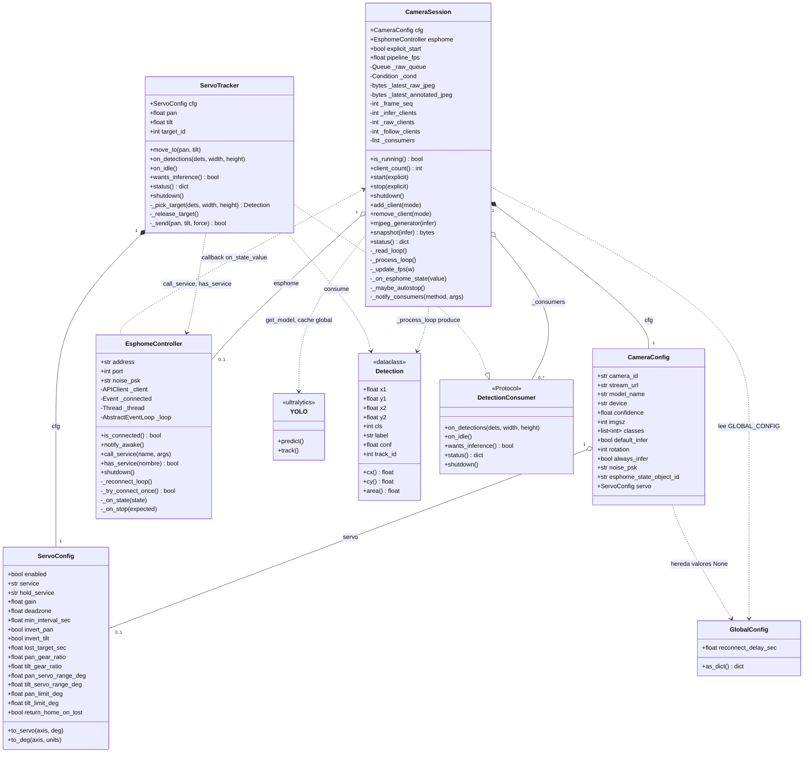
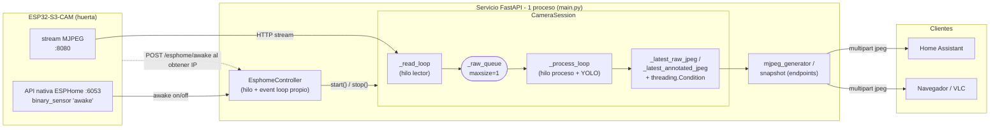
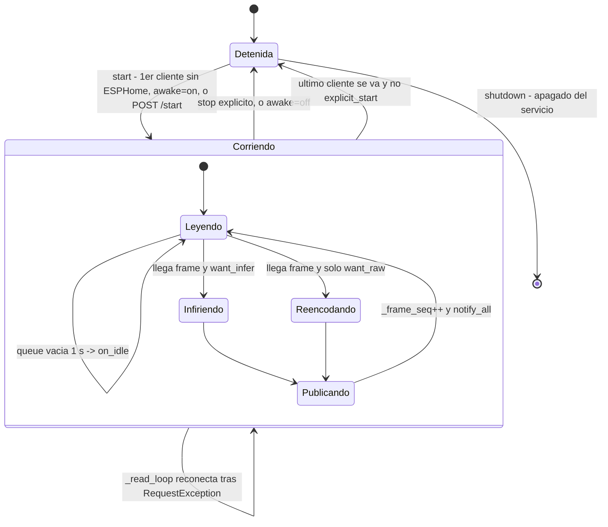
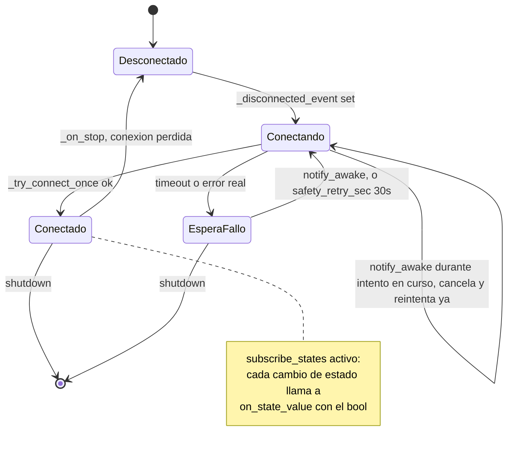

# Arquitectura de `detect/`

Documento de referencia del servicio de inferencia YOLO. Explica cómo encaja
en el proyecto, el modelo de concurrencia, y qué hace cada clase, método y
endpoint. El reparto por ficheros está en la [§0](#0-los-módulos).

Para instalar y arrancar el servicio, ver [`README.md`](../README.md). Para
cuánto vive cada instancia, qué la destruye y cómo se cierran los sockets
cuando la placa se duerme, ver [`CICLO-DE-VIDA.md`](CICLO-DE-VIDA.md).

> El diagrama de clases UML está en la [§3](#3-diagrama-de-clases-uml); el
> resto (flujo de datos, ciclo de vida y secuencia) está en la
> [§11](#11-diagramas). Se renderizan con
> [Mermaid](https://mermaid.js.org/): GitHub los pinta solos y en VS Code hace
> falta la extensión *Markdown Preview Mermaid Support*.

---

## 0. Los módulos

| Fichero | Qué es | Líneas |
| --- | --- | --- |
| [`camera.py`](../camera.py) | El pipeline de vídeo: leer del ESP32, inferir con YOLO y repartir el stream. Todo lo que ocurre por frame. | 1180 |
| [`main.py`](../main.py) | Solo la API HTTP: el `lifespan` y los endpoints. | 1019 |
| [`gl_keeper.py`](../gl_keeper.py) | Lanza un `python.exe` hijo con una ventana OpenGL oculta mientras haya cámaras en CUDA, para que la GTX 1080 no baje a P5 con `yolo26n`. Aislado a propósito para poder quitarlo: los pasos están en su docstring. Ver [GPU.md](GPU.md). | 219 |
| [`recorder.py`](../recorder.py) | `ClipRecorder`: cuándo se graba un clip y cómo se encolan los frames sin frenar la inferencia. El segundo consumidor de detecciones. Ver [GRABACION.md](GRABACION.md). | 699 |
| [`clips.py`](../clips.py) | Los clips que hay en disco: rutas, listado, y la retención por días y por GB. Global, no por cámara. | 550 |
| [`encoders.py`](../encoders.py) | Convertir JPEG en MP4 **H.264**. Dos implementaciones (ffmpeg externo y OpenCV) y la corrección de fps variable. | 302 |
| [`supervisor.py`](../supervisor.py) | Proceso padre que lanza y vigila a uvicorn y expone `/service/*` en `:8081` (parar, arrancar, reiniciar). Copia su salida y la de uvicorn a `logs/supervisor.log` (rota a 5 MB × 3). Del proyecto solo importa `log`. | 243 |
| [`esphome_api.py`](../esphome_api.py) | `EsphomeController`: la conexión con la API nativa de la placa. No sabe nada de cámaras, ni de YOLO, ni del hardware concreto: cada variante llama a los servicios que publique su YAML. | 318 |
| [`servo_tracker.py`](../servo_tracker.py) | La torreta pan/tilt, como consumidor de detecciones. | 181 |
| [`detections.py`](../detections.py) | `Detection` y el protocolo `DetectionConsumer`: la frontera entre el pipeline y lo que se hace con lo que ve. | 114 |
| [`shutdown.py`](../shutdown.py) | La bandera de apagado y el hook de señal encadenado a uvicorn. | 61 |
| [`registry.py`](../registry.py) | Alta, baja y persistencia de las cámaras en `cameras_config.json`. | 54 |
| [`log.py`](../log.py) | El `print` con marca de hora (y copia opcional a fichero rotado). Los demás hacen `from log import print`. | 15 |

Sin ciclos de importación: `log` y `detections` no importan nada del
proyecto; `supervisor` ← `log`; `servo_tracker` ← `detections`; `esphome_api` ← `log`;
`encoders` ← `log`; `clips` ← `log`; `recorder` ← `detections` + `clips` +
`encoders`; `camera` ← todos los anteriores + `shutdown`; `registry` ←
`camera`; `gl_keeper` ← `camera` + `log` (importados dentro de las funciones,
para que el proceso hijo no cargue torch); `main` ← todos.

**Por qué la grabación son tres módulos y no uno.** `recorder.py` es *lo que
pasa por frame en una cámara* y nace y muere con su sesión; `clips.py` es *lo
que hay en disco*, es global y su barrido de retención tiene que correr aunque
no haya ninguna sesión viva (el tope en GB es del disco, no de la cámara); y
`encoders.py` no sabe de cámaras ni de detecciones, solo de convertir JPEG en
MP4. Es la misma frontera que separa `servo_tracker.py` de `registry.py`, y lo
que permite probar la máquina de estados entera con un encoder de mentira.

---

## 1. El proyecto en conjunto

El repositorio tiene **dos mitades independientes** que se comunican por red:

| Carpeta | Qué es | Lenguaje |
| --- | --- | --- |
| [`esphome/`](../../esphome/) | Firmware de las placas ESP32-S3-CAM: cámara exterior con PIR + deep sleep, cámara-proxy siempre encendida, torreta pan/tilt. | YAML de ESPHome + componente C++ parcheado |
| [`detect/`](..) | Servicio Python (FastAPI) que hace la inferencia YOLO sobre el vídeo de esas cámaras y lo reparte a varios clientes. | Python |

La placa `huerta` ofrece dos canales:

- **Stream MJPEG por HTTP** (`:8080`) y snapshot (`:8081`) — el vídeo.
- **API nativa de ESPHome** (`:6053`) — control y estado. Expone un
  `binary_sensor` llamado `awake`: `ON` = la placa está despierta (PIR),
  `OFF` = está a punto de dormir.

El servicio Python consume los dos: el vídeo por HTTP y el estado por la API
nativa (con `aioesphomeapi` y la `api.encryption.key` del YAML de la placa).

---

## 2. Visión de conjunto del servicio

Es un **único proceso** `uvicorn` (obligatorio `--workers 1`: todo el estado
vive en memoria de ese proceso). Dentro conviven **tres mundos de
concurrencia**:

1. **El event loop de asyncio** de FastAPI/uvicorn — atiende las peticiones
   HTTP.
2. **Hilos por cámara** (`threading`) — un hilo lector y un hilo de proceso
   por cada `CameraSession`. Se usa `threading` y no `asyncio` porque
   YOLO/PyTorch y `requests.iter_content()` son llamadas bloqueantes de
   CPU/IO que congelarían el event loop.
3. **Un hilo + event loop propio por cada `EsphomeController`** — para hablar
   con la API nativa de ESPHome (que es `async`) desde código síncrono sin
   bloquear nada.

### Flujo de datos de una cámara

```
ESP32-S3-CAM                  CameraSession                         Clientes HTTP
────────────                  ─────────────                         ─────────────
stream MJPEG  ──HTTP──►  _read_loop (hilo lector)
:8080                         │  parsea multipart por Content-Length
                              │  cv2.imdecode → frame numpy
                              ▼
                         _raw_queue (queue.Queue maxsize=1)  ◄── solo el frame más reciente
                              │
                              ▼
                    _process_loop (hilo de proceso)
                         │  ¿hay clientes que quieran inferencia?
                         │    sí → model.track() + dibuja cajas → JPEG anotado
                         │    no → solo re-encoda el JPEG crudo
                         │  si no llega frame en 1 s → avisa a los consumidores (on_idle)
                         ▼
              _latest_raw_jpeg / _latest_annotated_jpeg
              + self._cond.notify_all()  (threading.Condition)
                         │
                         ▼
              mjpeg_generator(infer)  ──multipart/x-mixed-replace──►  HA / navegador / VLC…
              snapshot(infer)         ──image/jpeg──►

API nativa ESPHome ──►  EsphomeController  ──on_state_value──►  _on_esphome_state
:6053  (binary_sensor 'awake')                                    awake on  → session.start()
                                                                   awake off → session.stop()
```

La idea central: **una sola conexión al ESP32, una sola inferencia, N
clientes**. El firmware `esp32_camera_web_server` solo admite un consumidor de
stream a la vez, así que este servicio es el único que abre conexión contra la
placa y hace de multiplexor hacia Home Assistant, el navegador, VLC, etc.

---

## 3. Diagrama de clases (UML)

Relaciones entre las clases del servicio: [`camera.py`](../camera.py),
[`esphome_api.py`](../esphome_api.py), [`servo_tracker.py`](../servo_tracker.py)
y [`detections.py`](../detections.py). `*--` = composición (la vida del hijo
depende del padre), `o--` = agregación (referencia opcional), `..>` =
dependencia de uso, `..|>` = implementación de un `Protocol`.



---

## 4. Utilidades y estado global

### `print(*args, **kwargs)` — [`log.py`](../log.py)

Envoltura sobre el `print` nativo (guardado en `_orig_print`) que antepone la
hora local en formato `[HH:MM:SS.mmm]`, el mismo que usa el log de ESPHome,
para poder cotejar tiempos entre ambos logs.

`enable_file(path, max_bytes, backups)` copia además cada línea a un fichero
con `RotatingFileHandler`; `write_raw(line)` escribe una línea sin añadirle
hora (la salida del hijo que reenvía el supervisor). Solo `supervisor.py` los
usa: en uvicorn el fichero no se activa y `print` se comporta igual que antes.

### `CUDNN_ENABLED` — [`main.py`](../main.py)

Decide `torch.backends.cudnn.enabled`. Va a `False` en la GTX 1080 (Pascal):
con cuDNN activo se produce `CUDA misaligned address`. En cualquier otra
tarjeta, `True`. Detalle en [`GPU.md`](GPU.md#1-cudnn-y-cuda-misaligned-address).

### Constantes — [`camera.py`](../camera.py)

Colores y grosores de las cajas de detección, y `_CONTENT_LENGTH_RE` (la regex
que usa `_iter_jpegs`). `CAMERAS_CONFIG_FILE`, que es dónde se persiste la
lista de cámaras, vive con el registro en [`registry.py`](../registry.py).

### `_iter_jpegs(chunks)` — [`camera.py`](../camera.py)

Generador **puro** que trocea el multipart del ESP32 y va soltando los JPEG uno
a uno, usando el `Content-Length` que declara cada parte. Buscar a mano los
marcadores `\xff\xd8` / `\xff\xd9` se desincronizaba cuando esos bytes
aparecían dentro de los datos comprimidos de un JPEG real, y provocaba cuelgues
de varios minutos.

Vive fuera de `_read_loop` justamente por ser puro —un iterable de bytes
entra, JPEG salen; ni sockets ni hilos—: así se puede probar sin red la
cabecera partida entre chunks, el cuerpo partido, el JPEG con marcadores
dentro, la parte sin `Content-Length` y el salvavidas del buffer. Antes estaba
incrustado en el bucle y no se probaba ninguno de esos casos.

### `_force_close_response(resp, tag)` — [`camera.py`](../camera.py)

Cierra la conexión HTTP con el ESP32 **sin bloquear a quien llama**. Hace
`sock.shutdown(SHUT_RDWR)` sobre el socket subyacente antes del `close()`,
porque `resp.close()` a secas no interrumpe el `recv()` en curso del hilo
lector: medido, `stop()` tardaba 12 s en volver, y lo llama el event loop del
`EsphomeController`. Con el `shutdown` previo baja a ~0,01 s. Si no encuentra
el socket (las tripas de `urllib3` cambian entre versiones) delega el
`close()` a un hilo desechable. Detalles en
[`CICLO-DE-VIDA.md`](CICLO-DE-VIDA.md#6-cierre-de-la-conexión-http-con-la-cámara).

### `lifespan(app)` — [`main.py`](../main.py)

Context manager del ciclo de vida de FastAPI:

- **Al arrancar:** `load_cameras_from_disk()` recarga las cámaras registradas.
- **Al apagar:** llama a `session.shutdown()` de cada cámara. Como
  `shutdown()` es bloqueante (hace `.join()` sobre hilos), lo ejecuta con
  `asyncio.to_thread` + `asyncio.wait_for(timeout=5)` para no congelar el
  event loop de uvicorn mientras cierra las conexiones de clientes activos. Si
  una tarda más de 5 s, la deja (son hilos daemon, no bloquean el cierre del
  proceso).

### `class GlobalConfig` — [`camera.py`](../camera.py)

Config global, persistida en `global_config.json` y visible en `GET /config`.
Campos:

- `reconnect_delay_sec` — espera entre reintentos del hilo lector (1 s).

`as_dict()` la serializa para el endpoint `GET /config`. La instancia única es
`GLOBAL_CONFIG`.

### `get_model(name, device, owner)` — [`camera.py`](../camera.py)

Caché de modelos YOLO con **una instancia por cámara**. Clave
`"{name}_{device}_{owner}"` (`"shared"` si no hay `owner`). Si dos cámaras
compartieran el objeto `YOLO`, compartirían también el predictor y el
ByteTrack, y se mezclaría el seguimiento de ambas escenas. Quien no hace
tracking (`/detect-file`, los scripts de `test/`) llama sin `owner` y comparte
instancia. `release_model()` suelta el de una cámara al darla de baja, para
que la VRAM no se vaya llenando.

La primera vez: `YOLO("{name}.pt")`, `.to(device)`, y una inferencia dummy sobre
un frame negro 640×640 para **precalentar** (la primera inferencia real de
YOLO es lentísima). Protegido con `_models_lock` para que dos cámaras
arrancando a la vez no carguen el mismo modelo dos veces.

**El precalentamiento no depende del GL keeper, y no hay que quitarlo aunque
el keeper esté encendido.** El dummy paga una sola vez lo que cuesta la primera
inferencia: arrancar CUDA/cuBLAS en el proceso, cargar kernels, reservar
memoria y preparar el predictor de ultralytics. El keeper solo impide que el
driver baje el reloj mientras se infiere, y además se enciende cuando ya hay
una cámara funcionando, es decir, después de `get_model()`. Sin el dummy, esos
segundos caerían sobre el primer frame real, dentro del hilo `yolo-*`.

`DEFAULT_DEVICE` (CUDA si hay, si no CPU) es dónde corre el endpoint de prueba
puntual `/detect-file`; el modelo lo elige quien llama y se carga perezosamente
por aquí, así que no se penaliza el arranque si solo se usan cámaras.

---

## 5. `class EsphomeController` — [`esphome_api.py`](../esphome_api.py)

Conexión persistente a la **API nativa de ESPHome** (puerto 6053) de **una**
placa. Maneja `APIClient` de `aioesphomeapi` directamente, sin
`ReconnectLogic`, porque es un solo dispositivo con IP conocida y así no
depende de mDNS ni de atributos privados de la librería.

Corre en su **propio hilo con su propio event loop** (`_loop`, `_thread`
daemon llamado `esphome-<address>`), para poder ser llamado desde hilos
síncronos (`CameraSession`) sin bloquearlos.

**Para qué se usa:**

- `call_service(name, **args)` — llama a cualquier `api: services:` del YAML si
  existe.
- Vigilar una entidad (`watch_entity_object_id`, p. ej. `awake`) y llamar a
  `on_state_value(bool)` cada vez que cambia, para arrancar/parar la cámara
  según el hardware real.

### `__init__(...)` — [`esphome_api.py`](../esphome_api.py)

Guarda parámetros. Los más sutiles:

- `safety_retry_sec` (30 s) — red de seguridad: si un intento de conexión
  falla, espera pasivamente **hasta** este tiempo *o* hasta que
  `notify_awake()` la despierte antes.
- `connect_attempt_timeout_sec` (1 s) — acota cada `connect()` individual. Sin
  esto, si `notify_awake()` llega mientras hay un intento fallido "en vuelo"
  contra la placa dormida, la señal buena tendría que esperar ~10 s a que ese
  intento viejo agote el timeout por defecto de la librería.

Crea `_disconnected_event` (arranca en `set()` → primer intento inmediato),
`_wake_event`, `_connected` (`threading.Event`), y lanza el hilo.

### `is_connected` (property) — [`esphome_api.py`](../esphome_api.py)

`True` si `_connected` está marcado.

### `_run_loop()` — [`esphome_api.py`](../esphome_api.py)

Punto de entrada del hilo: fija el event loop propio y corre
`_reconnect_loop()` hasta que termine. En un `finally` llama a `_close_loop()`,
que cierra el cliente, cancela las tareas pendientes y cierra el loop **dentro
de este hilo** — el único sitio donde el loop sigue vivo y se puede esperar de
verdad a que el socket con la placa se cierre.

### `_reconnect_loop()` (async) — [`esphome_api.py`](../esphome_api.py)

El bucle de reconexión, con **cero polling mientras está conectado**:

1. Espera a `_disconnected_event`.
2. Lanza en paralelo `_try_connect_once()` y la espera de `_wake_event`, y
   toma lo primero que acabe (`FIRST_COMPLETED`).
3. **Si acaba la conexión:**
   - éxito → limpia `_disconnected_event` y se queda dormido hasta que
     `_on_stop` lo vuelva a marcar.
   - fallo real → espera `safety_retry_sec` o hasta `_wake_event`, y
     reintenta.
4. **Si acaba antes `_wake_event`** (nos avisaron mientras el intento seguía
   en curso, típicamente contra la placa aún dormida) → **cancela** el intento
   en vez de esperar su timeout, hace `disconnect()` para dejar el cliente
   limpio, y reintenta ya.

### `_try_connect_once()` (async) → `bool` — [`esphome_api.py`](../esphome_api.py)

Un intento de conexión acotado a `connect_attempt_timeout_sec`. Si conecta:
pide `list_entities_services()`, guarda todos los servicios que publica la
placa en `_services` (por nombre, para `has_service` / `call_service`) y
localiza la `key` numérica de la entidad vigilada (`watch_entity_object_id` →
`_watch_key`), se suscribe a estados con `subscribe_states(self._on_state)`,
marca `_connected` y loguea el tiempo que tardó. Devuelve `True`/`False`.

### `_on_stop(expected_disconnect=False)` (async) — [`esphome_api.py`](../esphome_api.py)

Callback que `APIClient` invoca al perder la conexión. Limpia `_connected` y
marca `_disconnected_event` para que el bucle reintente. El argumento tiene
valor por defecto porque su firma varía entre versiones de `aioesphomeapi`.

### `notify_awake()` — [`esphome_api.py`](../esphome_api.py)

API pública **thread-safe** (`call_soon_threadsafe`) para marcar
`_wake_event`. La llama el endpoint `POST /cameras/{id}/esphome/awake`, que a
su vez lo golpea el propio ESP32 en `wifi.on_connect`. Salta la espera de
`safety_retry_sec`.

### `_on_state(state)` — [`esphome_api.py`](../esphome_api.py)

Callback de `subscribe_states`, corre en el loop propio. Si `state.key`
coincide con `_watch_key` y no está `missing_state` (aún sin publicar), llama a
`on_state_value(state.state)` con el bool, capturando excepciones del callback.

### `call_service(name, **args)` — [`esphome_api.py`](../esphome_api.py)

Si está conectado y el servicio existe, programa `_execute_service` en el loop
propio con `run_coroutine_threadsafe` (llamable desde cualquier hilo).

Devuelve si se llegó a encolar: `False` si no hay conexión, si el loop ya está
cerrado o si **la placa no publica ese servicio**. Eso último es lo que permite
que un firmware sin ese hardware no rompa nada, y es cómo una variante nueva
comprueba si está soportada. `nombre` va posicional-only para que un argumento
del servicio llamado `nombre` no choque con él.

### `_execute_service(name, service, args)` (async) — [`esphome_api.py`](../esphome_api.py)

Ejecuta `execute_service(servicio, args)` y loguea el fallo con el nombre del
servicio si lo hay.

### `has_service(nombre)` / `services` — [`esphome_api.py`](../esphome_api.py)

Si la placa publica ese servicio, y la lista completa de los que publica.
Llamar a uno que no existe falla en silencio, y desde fuera es indistinguible
de apuntar mal o de un relé mal cableado; esto lo expone en `/status` y en el
log de conexión para descartarlo de un vistazo.

### `shutdown()` — [`esphome_api.py`](../esphome_api.py)

Marca `_stopping`, levanta los dos eventos que hacen salir a
`_reconnect_loop` por su propio pie (con `call_soon_threadsafe`, porque se
llama desde fuera del hilo) y **espera al hilo** hasta `timeout` (1,5 s por
defecto). El cierre real del socket y del loop lo hace el propio hilo en
`_close_loop()`. Idempotente: si ya está cerrado, no hace nada.

> **No para el loop a la fuerza.** Antes hacía `loop.stop()` justo después de
> programar `disconnect()`, y el loop paraba antes de que esa corrutina llegara
> a ejecutarse: el socket con la placa quedaba abierto hasta que moría el
> proceso (un descriptor filtrado por cada `DELETE` de cámara) y
> `run_until_complete` reventaba con *"Event loop stopped before Future
> completed"*, matando el hilo con un traceback.

---

## 6. `class CameraConfig(BaseModel)` — [`camera.py`](../camera.py)

Modelo Pydantic con la config de una cámara. Se valida al registrarla y se
serializa a `cameras_config.json`.

| Campo | Significado |
| --- | --- |
| `camera_id` | Identificador único en las rutas. |
| `stream_url` | URL del stream MJPEG del ESP32. |
| `model_name` / `device` | Modelo YOLO (`yolo26m` por defecto, `DEFAULT_MODEL`) y `cuda` / `cpu`. En la GTX 1080, con una sola cámara se recomienda `yolo26m`: con `yolo26n` la GPU baja a P5 y da detecciones corruptas (ver [`GPU.md`](GPU.md)). |
| `confidence` / `imgsz` | Umbral de confianza y resolución de inferencia. |
| `classes` | Lista de IDs de clase COCO a detectar (`None` = todas; `[0]` = solo personas). |
| `default_infer` | Qué devuelven `/stream` y `/snapshot` si no se pasa `?infer=` (anotado o crudo). |
| `rotation` | Giro de la imagen en grados, sentido horario: 0, 90, 180 o 270. Para un módulo de cámara montado de lado: el sensor solo sabe voltear, no girar 90°. Se aplica nada más decodificar, así que YOLO, el stream, los clips y los servos ven ya la imagen derecha. |
| `always_infer` | Si YOLO corre aunque no haya nadie mirando ni ningún consumidor. `True` por defecto: la cámara sigue detectando con el navegador cerrado. **No confundir con `default_infer`**: aquel decide *qué* se devuelve, este *si* la detección llega a correr. |
| `noise_psk` | `api.encryption.key` del YAML de la placa. Si se rellena, la sesión abre además el `EsphomeController`. |
| `esphome_state_object_id` | `object_id` del `binary_sensor` a vigilar (`"awake"` por defecto). |
| `servo` | Sección anidada (`ServoConfig`) con los ajustes de la torreta pan/tilt. `None` = esta variante de placa no lleva servos y no se crea el consumidor. Requiere `noise_psk`, porque las órdenes van por la API nativa. |

Ver [`cameras_config.example.json`](../cameras_config.example.json) para un
ejemplo completo.

---

## 7. `class CameraSession` — [`camera.py`](../camera.py)

El corazón del servicio. Una instancia por cámara registrada. Encapsula los
dos hilos, el estado compartido y la lógica de arranque/parada.

### `__init__(cfg)` — [`camera.py`](../camera.py)

Crea todo el estado:

- `_lock` — protege contadores y arranque/parada.
- `_reader_thread`, `_processing_thread`, `_stop_event` — los hilos y su señal
  de parada.
- `_raw_queue` (`maxsize=1`) — buffer de un frame entre lector y proceso.
- `_cond` (`threading.Condition`) + `_latest_raw_jpeg` /
  `_latest_annotated_jpeg` / `_frame_seq` — el "buzón" del último frame
  publicado en cada modo y el número de secuencia para despertar a los
  generadores.
- `_infer_clients` / `_raw_clients` / `_follow_clients` — **tres** contadores
  de clientes según qué stream piden (anotado fijo / crudo fijo / "sigue
  `default_infer` en caliente"). En `/status` se publican sumados, como
  `clients`: el reparto por modo solo le importa a `_work_needed()`.
- `explicit_start` — flag "arrancada a mano por API, no parar aunque no haya
  clientes".
- `_current_response` — referencia a la conexión HTTP viva, para cerrarla a la
  fuerza al parar.
- `_fps_window` (`deque`) — ventana deslizante de ~1 s para calcular FPS
  estable.
- Métricas para `/status`: `last_frame_time`, `last_inference_ms`,
  `pipeline_fps` y `_corrupt_frames` (sale como `corrupt_frames`: frames con
  alguna caja imposible, no cajas).
- Si `cfg.noise_psk`: saca el host de `stream_url` y crea el
  `EsphomeController` con `on_state_value=self._on_esphome_state`.

### `_on_esphome_state(value)` — [`camera.py`](../camera.py)

Callback del `EsphomeController`. Ignora `None`. En flanco a `on` →
`start(explicit=True)`; en flanco a `off` → `stop(explicit=True)`.

Deduplica repeticiones (la placa republica el estado al reconectar) **solo si
la sesión ya está como debería**: `value == self._last_esphome_state and value
== self.is_running`. Así un `on` repetido rearranca la sesión si la lectura
estaba parada — el caso de una placa que se durmió sin llegar a publicar el
`off`, que antes dejaba la cámara muerta.

Ojo al modificarlo: **corre en el event loop del `EsphomeController`**, así que
nada de lo que llame puede bloquear.

### `is_running` (property) — [`camera.py`](../camera.py)

`True` si el hilo lector o el de proceso siguen vivos.

### `client_count` (property) — [`camera.py`](../camera.py)

Suma de los tres contadores de clientes.

### `start(explicit=False)` — [`camera.py`](../camera.py)

Bajo `_lock`: si ya corre, no hace nada. Si no, **crea objetos nuevos** de
`_stop_event`, `_raw_queue` y `_fps_window` (no los recicla — ver
[§10](#10-decisiones-de-diseño-que-conviene-entender)), lanza los dos hilos
daemon y los arranca. `explicit=True` además fija `explicit_start`.

### `stop(explicit=False)` — [`camera.py`](../camera.py)

Si quedan clientes y no es `explicit`, no para. Si no: marca `_stop_event`,
cierra la conexión HTTP viva con `_force_close_response()` (fuera del lock, y
a la fuerza: ver §4) y hace `_cond.notify_all()` para despertar ya a los
generadores en vez de esperar su timeout de 1 s. `explicit=True` limpia
`explicit_start`. Vuelve en ~0,01 s incluso con el stream activo, que es lo
que permite llamarlo desde el loop de ESPHome.

### `shutdown()` — [`camera.py`](../camera.py)

`stop(explicit=True)` → `esphome.shutdown(timeout=1.5)` (primero, para que deje
de reintentar contra la placa mientras los hilos de vídeo salen) → `join()` de
los dos hilos con un **deadline compartido de 2,5 s** → `notify_all()`.

Presupuesto total acotado a ~4 s a propósito: `lifespan` solo da 5 s por sesión
y uvicorn arranca con `--timeout-graceful-shutdown 5`. Los hilos son daemon: si
alguno se pasa del plazo se deja dicho en el log pero no impide que el proceso
muera.

### `_maybe_autostop()` — [`camera.py`](../camera.py)

Si no hay `explicit_start` ni clientes, marca `_stop_event`. Lo llama
`remove_client`.

### `_resolve_mode(infer)` (staticmethod) — [`camera.py`](../camera.py)

Traduce el query param: `True → "true"`, `False → "false"`, `None →
"follow"`.

### `add_client(mode)` — [`camera.py`](../camera.py)

Incrementa el contador correspondiente. **Solo arranca la sesión aquí si NO
hay `EsphomeController`**: con control ESPHome, arrancar sin saber si la placa
está despierta dejaría el hilo lector reintentando en bucle contra una cámara
dormida; en ese caso el arranque lo dispara `awake=on`.

### `remove_client(mode)` — [`camera.py`](../camera.py)

Decrementa (con suelo en 0) y llama a `_maybe_autostop()`.

### `_read_loop()` — [`camera.py`](../camera.py) — hilo lector

Toma referencias **locales** de `_stop_event` y `_raw_queue` (clave: ver
[§10](#10-decisiones-de-diseño-que-conviene-entender)). Bucle:

1. `requests.get(stream_url, stream=True, timeout=(3, 15))`, guarda la
   respuesta en `_current_response` y comprueba `stop_event` por si nos
   pararon mientras se abría (en ese hueco `stop()` leyó un
   `_current_response` todavía a `None` y no pudo cerrarla). El connect
   timeout es de 3 s porque es el tiempo máximo que este hilo puede tardar en
   enterarse de un `stop()` si le pilla justo ahí.
2. Lee con `iter_content(chunk_size=4096)` y acumula en `buffer`.
3. **Parsea el multipart por `Content-Length`**: alterna entre "buscando
   cabecera" (busca `\r\n\r\n`, extrae `Content-Length` con la regex →
   `expected_len`) y "leyendo cuerpo" (cuando hay `expected_len` bytes, corta
   el JPEG). No busca los marcadores `\xff\xd8` / `\xff\xd9` a mano porque esos
   bytes aparecen dentro de JPEG comprimidos reales y desincronizaban el
   stream (cuelgues de minutos, confirmado moviendo la cámara físicamente).
4. Cada JPEG: `cv2.imdecode` → `cv2.rotate` si `cfg.rotation` no es 0 → si la cola está llena descarta el viejo
   (`get_nowait`) y mete el nuevo → **siempre el frame más reciente**.
5. Salvaguarda: si `buffer` pasa de 2 MB, lo resetea.
6. **En cualquier `Exception`** (amplio a propósito: cerrar la respuesta desde
   otro hilo hace saltar `RequestException`, pero también `ValueError("I/O
   operation on closed file")` o `AttributeError`, según dónde pille a
   `urllib3`; cazando solo `RequestException` esos casos mataban el hilo con
   un traceback). Por orden:
   - si `stop_event` está marcado → **rompe** sin log ni espera: la excepción
     es la consecuencia de la parada, no la causa;
   - si nadie quiere ya la cámara (`not explicit_start and client_count == 0`)
     → **rompe**;
   - si la sesión la gobierna ESPHome y la API nativa también está caída → la
     placa está dormida, **rompe** en vez de machacar una IP muerta cada
     segundo (el siguiente `awake=on` rearranca, ver `_on_esphome_state`);
   - si no, espera `reconnect_delay_sec` y reintenta.
7. `finally`: limpia `_current_response` y cierra la respuesta.

### `_update_fps(fps_window)` — [`camera.py`](../camera.py)

Añade el timestamp actual, descarta los de hace más de 1 s, y calcula
`pipeline_fps` como `(n-1) / span` sobre la ventana.

### `_process_loop()` — [`camera.py`](../camera.py) — hilo de proceso

Referencias locales otra vez. Obtiene el modelo con `get_model()`. Bucle:

1. Decide qué hace falta, **antes** del `get()` y releyendo los contadores y la
   config en cada vuelta (por eso cambiar `default_infer` o `always_infer` por
   API afecta a streams ya abiertos, sin reconectar):
   - `want_draw` = hay `_infer_clients`, o hay `_follow_clients` y
     `default_infer` está a `True`. Es decir: **alguien está mirando el vídeo
     anotado**.
   - `want_infer` = `cfg.always_infer` **o** `want_draw` **o** algún consumidor
     pide inferencia (`wants_inference()`). Con `always_infer` (por defecto
     `True`) la cámara **sigue detectando con el navegador cerrado**; un
     seguimiento de servos necesita las detecciones pero no el dibujo, así que
     sin clientes se ejecuta YOLO y se ahorra pintar cajas y recodificar el JPEG.
   - `want_raw` = hay `_raw_clients`, o hay `_follow_clients` y `default_infer`
     a `False`.
2. `raw_queue.get(timeout=1.0)`: vuelve en cuanto llega el frame; el timeout
   solo sirve para revisar `stop_event`.
3. **Si salta `queue.Empty`** (no llegó frame): avisa a los consumidores con
   `on_idle()` (ver §7.bis) para que puedan caducar su objetivo. Luego
   `continue`.
4. **Si llega frame:** `_update_fps()`.
5. **Si `want_infer`:** `model.track(frame, persist=True,
   tracker="bytetrack.yaml", classes=...)`, y las cajas se traducen **una sola
   vez** a una lista de `Detection` (objetos planos, sin dependencia de
   ultralytics). `_drop_corrupt()` la vacía si trae alguna caja imposible
   (confianza fuera de `[0,1]`): un frame así se descarta **entero** y suma 1 a
   `corrupt_frames`. Con esa lista:
   - **si `want_draw`**, dibuja rectángulo, punto central y
     `label conf #track_id` por detección, añade el overlay de `ms`/device/fps y
     `cv2.imencode(".jpg")` → `annotated_bytes`;
   - y en cualquier caso la entrega a los consumidores con
     `on_detections(dets, w, h)`.

   Guarda `last_inference_ms`. Los errores solo van al log.
6. **Si `want_raw` o falló la inferencia:** `cv2.imencode` del frame crudo →
   `raw_bytes`.
7. Bajo `_cond`: actualiza `_latest_raw_jpeg` / `_latest_annotated_jpeg`,
   incrementa `_frame_seq`, fija `last_frame_time`, `notify_all()`.

### `mjpeg_generator(infer)` — [`camera.py`](../camera.py) — salida a cliente

Generador que FastAPI convierte en `StreamingResponse`. `add_client(mode)` al
entrar, `remove_client(mode)` en `finally`. Bucle: espera en `_cond.wait_for`
a que cambie `_frame_seq` (o pare, o timeout 1 s, que es cada cuánto revisa
la bandera de apagado si la cámara no publica), elige
`_latest_annotated_jpeg` o `_latest_raw_jpeg` según el modo (en `"follow"`
relee `cfg.default_infer` en cada frame → cambio en caliente sin reconectar),
y hace `yield` de la parte multipart (`--frame`, `Content-Type`,
`Content-Length`, bytes).

### `snapshot(infer)` — [`camera.py`](../camera.py)

Devuelve bajo `_cond` el último JPEG anotado o crudo (según `infer` o
`cfg.default_infer`). Sin bloqueo largo — puede devolver `None` si aún no hay
frame.

### `status()` — [`camera.py`](../camera.py)

Dict de diagnóstico para `/status`: running, `explicit_start`, `clients` (los
tres contadores sumados), últimas métricas, `corrupt_frames`,
`esphome_connected`, el `status()` de cada consumidor bajo `consumers` y la
config entera.

---

## 7.bis Consumidores de detecciones — [`detections.py`](../detections.py)

El punto de extensión del pipeline. Existe porque el proyecto tiene **varias
variantes de placa** (cámara sola, cámara+PIR, cámara+servos para seguimiento,
cámara+PIR+servos para la pistola) y meter la lógica de cada una dentro de
`_process_loop` lo convertiría en un amasijo de condicionales por variante,
imposible de probar sin GPU y sin hardware delante.

En su lugar, `_process_loop` solo **produce** detecciones y se las pasa a los
consumidores que la sesión tenga registrados en `self._consumers`.

- **`Detection`** — dataclass plana: `x1,y1,x2,y2` (píxeles del frame original),
  `cls`, `label`, `conf`, `track_id` (`None` si ByteTrack aún no lo confirmó) y
  las propiedades `cx`, `cy`, `area`. **No depende de ultralytics**: por eso los
  consumidores se prueban construyéndolas a mano.
- **`DetectionConsumer`** (Protocol) — `on_detections(dets, width, height)`,
  `on_idle()`, `wants_inference()`, `status()`, `shutdown()`.

**Todos los métodos corren en el hilo de proceso (`yolo-<camera_id>`), en el
camino crítico del vídeo: no deben bloquear.** Para hablar con la placa hay que
usar algo asíncrono como `EsphomeController.call_service()`, que solo encola la
orden en otro hilo.

`CameraSession` los invoca siempre a través de `_notify_consumers(method,
*args)`, que envuelve cada llamada en su propio `try`: un fallo de un consumidor
no puede tumbar el pipeline de vídeo. En `shutdown()` se les avisa **antes** que
al `EsphomeController`, para que puedan dejar el hardware en reposo con la
conexión todavía viva.

Añadir una variante nueva = un módulo con un consumidor + una sección en
`CameraConfig`. `_process_loop` no se vuelve a tocar.

### `ServoTracker` — [`servo_tracker.py`](../servo_tracker.py)

Primer consumidor: mueve una torreta pan/tilt para centrar un objetivo.

- **Elección de objetivo por bloqueo de track ID.** Engancha uno (el más cercano
  al centro de entre los que tienen `track_id`) y lo sigue mientras siga
  visible. Recalcular el "mejor" cada frame haría que la torreta saltara entre
  objetos en cuanto uno se acercara un píxel más al centro. Al perderlo se le da
  un margen de `lost_target_sec` antes de soltarlo, para que una oclusión de dos
  frames no cambie de objetivo.
- **Control proporcional sobre el error normalizado.** `ex = (cx - w/2)/(w/2)`,
  `ey` análogo, ambos en `[-1, 1]` (independientes de la resolución y de la
  orientación: con `rotation` el frame ya llega girado, así que el ancho de la
  imagen derecha es el eje de pan y el alto el de tilt). Se corrige
  `gain * error` (0.15) en cada envío en vez de calcular el ángulo exacto
  (medido en pan con la imagen girada: una unidad de servo desplaza la caja
  ~900 px, así que corregir el error entero sería ~0.27; con 0.3 se pasaba
  siempre y oscilaba). No
  conocemos ni la geometría del montaje ni el campo de visión de la lente, así
  que calcular ángulos sería inventarse una precisión que no existe. El lazo
  cerrado converge igual y no necesita calibración.
- **Relación de engranajes** (`pan_gear_ratio`, `tilt_gear_ratio`): el paso de
  cada eje se multiplica por las vueltas de servo por vuelta de cámara (dientes
  de la cámara / dientes del servo). En la torreta del servo el tilt va con
  piñón de 21 y corona de 63, así que 3; el pan va directo, 1. Sin esto el eje
  reducido centra el triple de lento. Dos engranajes engranados giran en
  sentidos opuestos, así que al añadir una reducción a un eje suele haber que
  dar la vuelta también a su `invert_*`: con el sentido mal, ese eje huye del
  objetivo hasta el tope.
- **Grados de cámara hacia fuera, unidades de servo dentro.** El lazo, la
  placa y `self.pan/self.tilt` van en -1..1. Lo que toca una persona va en
  grados de cámara: el body de `POST /servo` (`move_to`), `home_*_deg` (que se convierte y se guarda en la placa),
  `*_limit_deg` y `pan`/`tilt` de `/status` (que trae aparte
  `pan_servo`/`tilt_servo` y `limits_deg`). La conversión vive solo en
  `ServoConfig.to_servo`/`to_deg`: `grados = unidades × servo_range_deg / 2 /
  gear_ratio`. En la torreta del servo, con 180° nominales, una unidad son 90°
  de pan y 30° de tilt. Son grados **nominales**: `*_servo_range_deg` (180 por
  defecto) no está medido. El signo es el de la unidad de servo, sin aplicar
  `invert_*`. Una config guardada con los campos viejos (`home_pan`,
  `pan_limit`… en unidades de servo) se migra al cargarla
  (`_migrate_servo_units`), con el recorrido y la reducción del mismo dict.
- **Límites de recorrido** (`pan_limit_deg`, `tilt_limit_deg`; vacío = 0.9 de
  servo, ±81° de pan y ±27° de tilt con reducción 3): `_send` recorta toda orden
  a ±limit, venga del seguimiento, del control manual o del regreso a home, y
  nunca pasa de ±1 de servo. Los extremos del PWM suelen coincidir con el tope
  mecánico, y un servo pequeño forzado ahí consume mucha corriente y puede
  romper engranajes o quemarse.
- **Reenganche** (`_relock`): si el ID bloqueado desaparece, antes de esperar
  `lost_target_sec` se busca un ID nuevo de la misma clase cuya caja solape con
  la última vista (IoU ≥ 0.3). Si lo hay, se cambia de ID en el mismo frame
  (`servo: reenganche #a -> #b`) conservando la velocidad medida. ByteTrack le
  cambia el ID a alguien cercano con solo mover un brazo (la caja se deforma y
  la asociación falla), y sin esto la torreta se quedaba 1.5 s sin corregir
  con la persona delante.
- **Bordes cortados** (`_axis_error`): se centra, pero si la caja toca un borde
  que se persigue (a ≤ 2 px) el objeto se está saliendo por ahí y ese eje va
  hacia él con un error fijo de ±0.4 (`_CLIPPED_EDGE_ERROR`), que el lazo
  repite si hace falta. Con ±1 el tilt, multiplicado por la reducción, daba
  saltos de 0.6 de servo, se pasaba al extremo contrario y ByteTrack perdía el
  ID. Se persiguen:
  - **arriba, siempre**: alguien de pie a 1 m conserva la cabeza;
  - **los lados, solo si la caja ocupa menos de la mitad del ancho**. Una
    persona a 1 m llena casi todo el cuadro y toca los lados casi siempre:
    perseguirlos daba golpes de lado a lado y perdía el objetivo;
  - **abajo, nunca**: el cuerpo de alguien cerca sale siempre por abajo, y
    perseguirlo bajaba la cámara de golpe.

  Además, el centrado no puede bajar la cámara si la cabeza ya está en el 25 %
  superior de la imagen (`_TOP_GUARD_FRACTION`). Con alguien más alto que media
  imagen, el centro de la caja queda abajo: centrar bajaba paso a paso hasta
  cortar la cabeza, el borde de arriba subía de golpe, y vuelta a empezar. Con
  una franja del 10 % el retardo del stream hacía que un paso se la saltara.
- **Anticipación horizontal** (`lead_sec`, **0 = apagada por defecto**; p. ej.
  0.5 s para objetivos que cruzan andando). Con una persona cerca y sentada,
  su balanceo natural se colaba como velocidad y la anticipación lo
  amplificaba en una oscilación. Cuando está activa, se apunta a
  `cx + vx * lead_sec` en vez de a `cx`, así la torreta va por delante y queda
  más aire en la dirección en la que se mueve el objetivo. `vx` se mide solo con
  la cámara quieta (pasados `_SETTLE_SEC` = 0.6 s desde la última orden, y entre
  muestras del mismo track sin ninguna orden en medio), porque mientras gira la
  torreta lo que se mueve en la imagen es ella. Se mide por los **dos bordes**
  de la caja, no por el centro: solo cuenta si `x1` y `x2` se mueven en el mismo
  sentido, y entonces vale la del más lento. Estirar un brazo mueve un solo
  borde y desplazaba el centro, y la anticipación lo amplificaba en un vaivén
  con la persona quieta. Se suaviza con una media exponencial, por debajo de
  40 px/s no se anticipa (temblor de la caja), se topa a un cuarto del ancho,
  vuelve a 0 con cada objetivo nuevo y **caduca** al segundo sin medida nueva:
  con órdenes continuas la cámara casi nunca está quieta para medir, y sin
  caducidad la última velocidad quedaba congelada como un sesgo fijo. Solo en pan: en vertical manda la cabeza.
  La zona muerta se evalúa sobre la posición actual, sin anticipación: un
  objetivo centrado no mueve la torreta aunque ande, y la anticipación solo se
  suma cuando ya hay que corregir.
  El motivo de las líneas `salto` lleva `lead=±Npx` cuando se anticipó.
- **Diagnóstico**: cada enganche se registra con clase, confianza y posición
  (`servo: objetivo #N (person 0.83) en (x, y) de WxH`), y cada envío que mueve
  un eje ≥ 0.15 deja una línea `servo: salto ...` con el error y el motivo
  (centro, borde, manual, apagado). `status()` expone `last_target`. Un giro
  brusco sin línea `salto` no lo ha mandado el seguimiento (p. ej. un reinicio
  de la placa).
- **Zona muerta por eje** (`deadzone`, 0.08): un eje con el error dentro de la
  zona no se mueve, aunque el otro tenga que corregir; con los dos dentro no se
  envía nada. Sin ella el servo tiembla sin parar persiguiendo el ruido de la
  caja, que en una persona quieta baila más de un 6% entre frames.
- **Control por pasos.** Entre una orden y la imagen que la refleja pasa el
  retardo del pipeline (MJPEG de la placa + cola + YOLO): medido en la torreta
  del servo, el primer cambio llega a 0.2–0.42 s. Cada orden corrige
  `gain × error` desde la orden actual, y se espera `min_interval_sec` (0.6 s)
  a que el servo llegue y la imagen lo refleje antes de la siguiente. Si se
  manda antes, el mismo error se corrige varias veces y la torreta se pasa
  (con `gain=0.25` y 0.08 s se desbocaba hasta el tope). Con la placa
  interpolando cada paso es una rampa suave; sin interpolar se veía a tirones.
  La placa limita la velocidad ("Servo transition") y suaviza arranque y
  frenada con `x += (objetivo - x) · k` ("Servo smoothing"); ver
  `esphome/docs/servos-pan-tilt.md`. El suavizado retrasa la torreta: tiene
  que quedar muy por debajo de `min_interval_sec`.

  Hubo un modo continuo (`latency_sec`) que corregía desde la posición
  simulada de la torreta para poder mandar a 10 Hz. Se quitó: dependía de
  acertar a la vez el retardo y la velocidad de la placa, y con valores a ojo
  oscilaba.

  Velocidad y suavizado **solo viven en la placa**: los number "Servo
  transition" (`servo_transition`) y "Servo smoothing" (`servo_smoothing`),
  leídos con `EsphomeController.get_state` solo para mostrarlos.
  `transition_sec` y `smoothing_sec` en `POST /config/servo` solo los mandan a
  la placa, no se guardan en `ServoConfig`; `/status` muestra los valores en
  uso, `transition_source` (0 y "sin dato" si el firmware no lo publica) y
  `smoothing_sec` (None si no lo publica). Un eje sin error se queda donde está. Como red de seguridad, ninguna orden del
  seguimiento se aleja más de 0.15 de giro de cámara de la anterior
  (`_MAX_STEP` × `gear_ratio`). El control manual (`move_to`) salta el
  intervalo a propósito.
- **Hold: con el seguimiento activo no se suelta** (`_sync_hold`). Mientras
  `enabled` es true, haya objetivo o no, se llama a
  `set_servo_hold(hold=true)` (`ServoConfig.hold_service`) y la placa pone el
  auto-detach a 0. Con el PWM cortado el servo obedece a picos espurios de la
  señal: el pan daba giros solos de ~30° y volvía con la siguiente orden.
  Soltar solo al perder el objetivo no bastaba, porque de noche la detección
  va y viene. Al apagar el seguimiento (`set_config`, que es por donde
  `CameraSession` cambia la config) y en `shutdown` va `hold=false` y vuelve
  el valor del number "Servo auto detach", que no se toca. Activo, se repite
  cada `_HOLD_REFRESH_SEC` (3 s) desde `on_detections`/`on_idle`; el firmware
  lo caduca a los 10 s sin refresco, para que una caída del servicio no deje
  los servos sujetando para siempre. `/status` lo muestra en `hold`. Un
  firmware sin el servicio suelta como antes.

**Contrato con el firmware:** servicio `set_servo_position` con variables
`pan` y `tilt` en el rango **-1.0 a 1.0** (lo que espera `servo.write` de
ESPHome); los grados se quedan en el lado Python. El nombre es el valor por defecto de `ServoConfig.service` y se
comprueba con `has_service()` contra la lista que publica la placa: si se
renombra en el YAML sin cambiarlo en `POST /config/servo`, el seguimiento queda
mudo sin dar ningún error; `/status` lo expone en `consumers` justamente para
poder descartar eso de un vistazo. Firmware
de referencia: [`esphome/esp32-s3-cam-servo.yaml`](../../esphome/esp32-s3-cam-servo.yaml).

Pruebas: [`test/test_servo_tracker.py`](../test/test_servo_tracker.py), sin GPU
ni ESP32 (placa de mentira que apunta las órdenes recibidas).

---

## 8. Registro de cámaras (persistencia) — [`registry.py`](../registry.py)

`CAMERAS: dict[str, CameraSession]` protegido por `_cameras_lock`.

- **`save_cameras_to_disk()`** — vuelca `[s.cfg.dict() for s in
  CAMERAS.values()]` a `cameras_config.json` (indentado, UTF-8). Se llama tras
  cada alta/baja o cambio de config.
- **`load_cameras_from_disk()`** — al arrancar, lee el JSON y hace
  `register_camera(..., persist=False)` de cada entrada; cámaras inválidas se
  loguean y se saltan.
- **`register_camera(cfg, persist=True)`** — bajo lock: si el `camera_id` ya
  existe → `HTTPException(400)`; si no, crea la `CameraSession` (que a su vez
  puede crear el `EsphomeController`), la mete en `CAMERAS`, y persiste.
- **`get_camera(camera_id)`** — busca en `CAMERAS` o lanza
  `HTTPException(404)`.

`cameras_config.json` está en `.gitignore` porque contiene `noise_psk` e IPs
de la LAN.

---

## 9. Endpoints (FastAPI)

### Globales

| Método / ruta | Función | Qué hace |
| --- | --- | --- |
| `GET /health` | `health` | `{status, cameras}` — vivo y lista de IDs. |
| `GET /config` | `get_config` | Devuelve `GLOBAL_CONFIG` y el estado del GL keeper (`gl_keeper`: `enabled`, `active`, `error`). |
| `POST /config/gl-keeper` | `set_gl_keeper` | Interruptor del GL keeper (`enabled`, apagado por defecto), por formulario; se persiste en `global_config.json`. Al encenderlo se olvida un fallo anterior y se reintenta. |

### Gestión de cámaras

| Método / ruta | Función | Qué hace |
| --- | --- | --- |
| `GET /cameras` | `list_cameras` | `status()` de todas. |
| `POST /cameras` | `add_camera` | Alta por **formulario** (cada campo con su descripción y su defecto, en vez de un JSON a mano). `classes` va como texto separado por comas y lo traduce `_parse_classes`. **No pide servos**: se montan después con `/config/servo`. |
| `DELETE /cameras/{id}` | `remove_camera` | Saca de `CAMERAS`, `await asyncio.to_thread(session.shutdown)`, persiste. Va en un hilo porque `shutdown()` bloquea hasta ~4 s y congelaba el event loop entero (y con él todos los streams). |
| `GET /cameras/{id}/status` | `camera_status` | `status()` de una. |
| `POST /cameras/{id}/esphome/awake` | `esphome_awake` | La placa lo llama al obtener IP → `session.esphome.notify_awake()`. 400 si no tiene `noise_psk`. |
| `POST /cameras/{id}/start` \| `/stop` | `start_camera` / `stop_camera` | `session.start/stop(explicit=True)`. |
| `POST /cameras/start` \| `/stop` | `start_all_cameras` / `stop_all_cameras` | Lo mismo sobre todas las registradas; devuelve la lista de `status()`. No bloquea: `stop()` solo avisa a los hilos. |

### Config en runtime

| Método / ruta | Función | Qué hace |
| --- | --- | --- |
Cuelgan de `/config/`. Salvo `inference`, van por **formulario** (no JSON),
Swagger enseñe cada campo en su casilla con su descripción y su valor por
defecto.

| `POST /cameras/{id}/config/inference` | `set_inference_config` | Body JSON (`InferenceConfig`), todos los campos opcionales: **lo que no se envía se conserva** (`model_dump(exclude_unset=True)`); `classes: null` = todas, `null`/vacío en el resto = no tocar. Va en JSON y no en formulario porque Swagger rellena los formularios con `"string"`/`0` y los envía tal cual; con JSON, `app.openapi` se sustituye por `_openapi_with_camera_examples`, que regenera el esquema en cada `/openapi.json` metiendo como `examples` del body los valores actuales de cada cámara, así que en Swagger se edita partiendo de lo real (recargar `/docs` tras cambiar algo). Se filtra lo que no cambia respecto a `session.cfg` (reenviar el ejemplo entero es un no-op) y se sustituye `session.cfg` por `cfg.model_copy(update=...)`: `confidence`/`imgsz`/`always_infer`/`classes` se releen por frame y cambian al instante; `model_name`/`device` los resuelve `_process_loop` una sola vez al arrancar, así que cambiarlos precarga el modelo (400 si no existe) y llama a `session.restart()`. Devuelve `relaunched`. |
| `POST /cameras/{id}/config/stream` | `set_stream_default` | Cambia `default_infer` y/o `rotation` (lo que no se envía se conserva). `default_infer`: los streams en modo "follow" cambian en caliente. `rotation`: relanza la sesión para que ByteTrack empiece de cero. |
| `POST /cameras/{id}/config/servo` | `set_servo_config` | Body JSON parcial (`ServoConfigUpdate`): lo que no se envía se conserva, y los ejemplos de Swagger traen la `ServoConfig` actual de cada cámara. **Es donde se le ponen servos a una cámara**: el alta no los pide, así que la primera llamada crea el `ServoTracker` y lo enchufa como consumidor. 400 sin `noise_psk`. `transition_sec` y `auto_detach_sec` se mandan además a la placa con `EsphomeController.set_number` (numbers `servo_transition`/`servo_auto_detach`); `board_sent` en la respuesta dice si llegaron. `home_pan_deg`/`home_tilt_deg` tampoco se guardan aquí: se pasan a unidades de servo y van a los numbers `servo_home_pan`/`servo_home_tilt`, la única copia del reposo (la placa va ahí al arrancar y con su botón "Servos home"; `ServoTracker._home` la lee de ahí). |

### Servos (variantes con torreta)

| Método / ruta | Función | Qué hace |
| --- | --- | --- |
| `POST /cameras/{id}/servo` | `move_servo` | Control manual: `{"pan": p, "tilt": t}` en grados de cámara (0 = centro), recortado a los límites. Salta el rate limit del seguimiento, para poder verificar el hardware sin depender de que haya detecciones. |
| `POST /cameras/{id}/servo/home` | `servo_home` | Lleva la torreta al reposo de la placa (`ServoTracker.go_home`), como una orden manual. Lo usa el botón de home de Home Assistant. |

El seguimiento se activa/desactiva con el campo `enabled` de
`POST /cameras/{id}/config/servo`, junto al resto de ajustes; `/servo` a secas
queda solo para el movimiento manual, que es una acción y no configuración.

Ambos pasan por `get_servo_tracker(camera_id)`, que distingue los tres motivos
por los que la torreta puede no responder: **400** si la cámara no tiene sección
`servo` (o le falta `noise_psk`), **503** si no hay conexión con la placa, y
**503** con mensaje propio si la placa está conectada pero **no publica
`set_servo_position`** (firmware sin servos) — el caso que más despista, porque
la llamada al servicio falla en silencio.

### Consumo de vídeo

| Método / ruta | Función | Qué hace |
| --- | --- | --- |
| `GET /cameras/{id}/stream?infer=` | `stream_camera` | `StreamingResponse(session.mjpeg_generator(infer), media_type="multipart/x-mixed-replace; boundary=frame")`. `infer`: `true`=anotado, `false`=crudo, omitido=`default_infer`. |
| `GET /cameras/{id}/snapshot?infer=` | `snapshot_camera` | `add_client`, sondea `session.snapshot()` hasta 1 s (con `await asyncio.sleep`, no `time.sleep`, que bloqueaba todos los demás streams), `remove_client`; 503 si no hay frame. |

### Pruebas puntuales (sin sesión de cámara ni tracking)

| Método / ruta | Función | Qué hace |
| --- | --- | --- |
| `POST /detect-file` | `detect_file` | Fichero subido (`multipart/form-data`), eligiendo `model_name` / `confidence` / `imgsz`. Una sola inferencia, dos empaquetados según el campo `annotated`: `false` → JSON con `model`, `inference_ms` y detecciones (label, conf, box, centro); `true` → la imagen con las cajas de `results.plot()` más un overlay de modelo / ms / nº de detecciones, que es la única forma de ver esos números cuando la respuesta es una imagen. |

El overlay se escala con el tamaño de la imagen usando la misma fórmula que
`Annotator` de ultralytics (grosor a partir de `(alto+ancho)/2*0.003`,
`fontScale = grosor/3`): la imagen la sube quien llama y puede ser una
miniatura o una foto de 4000 px, y con una escala fija el texto salía ilegible
al lado de las cajas. Lleva fondo sólido porque el color fijo del stream se
pierde sobre una imagen clara.

---

## 10. Decisiones de diseño que conviene entender

**Hilos y no `async` para el pipeline.** YOLO/PyTorch y
`requests.iter_content()` bloquean; en el event loop congelarían todo el
servidor. Cada cámara son dos hilos daemon; FastAPI solo orquesta.

**Objetos nuevos por generación de hilos**
([`camera.py`](../camera.py)). `start()` no hace
`_stop_event.clear()` sobre el mismo objeto: crea uno nuevo. Si se reciclara,
un hilo viejo bloqueado en `queue.get()` que aún no vio el `stop()` anterior
despertaría, vería el evento ya limpio y seguiría corriendo → dos generaciones
de hilos pisándose `_fps_window` y demás. Con objeto nuevo, el hilo viejo
sigue mirando *su* evento (que sigue en `set()`) y se para solo. Por eso
`_read_loop` / `_process_loop` copian `_stop_event` y `_raw_queue` a variables
locales al empezar.

**Multiplexado por `threading.Condition` + `_frame_seq`.** Un solo
`_process_loop` publica; N `mjpeg_generator` esperan un cambio de número de
secuencia. No hay una cola por cliente: todos leen el mismo "último frame",
así que un cliente lento no acumula memoria, solo pierde frames.

**Inferencia solo bajo demanda.** `_process_loop` solo llama a `model.track()`
si algún cliente pide el stream anotado. Sin clientes de inferencia, solo
re-encoda JPEG.

**Sin keep-alive de GPU.** Hubo uno (inferencias dummy entre frames para que
la GTX 1080 no bajara a P5) y se quitó: con un modelo ligero no evitaba del
todo las corrupciones, y un modelo pesado (`yolo26m`) mantiene la GPU despierta
él solo. Con `yolo26n` las detecciones corruptas se descartan y los frames
afectados se cuentan en `corrupt_frames`. El porqué, en [`GPU.md`](GPU.md).

**GL keeper en vez de keep-alive.** Para usar `yolo26n` con varias cámaras,
`gl_keeper.py` mantiene la GPU despierta sin tocar el pipeline: un hilo del
servicio mira cada 2 s si hay alguna cámara funcionando en CUDA y, si el
interruptor está encendido, lanza un `python.exe` hijo con una ventana OpenGL
oculta; cuando no hay cámaras, lo termina. Va en un proceso aparte porque el
driver deja en P0 al proceso que ha tenido un contexto OpenGL hasta que acaba.
El hijo se cierra solo si el servicio muere (su stdin se cierra).

**Framing por `Content-Length`, no por marcadores JPEG.** Buscar `\xff\xd8` /
`\xff\xd9` a mano se desincronizaba con esos bytes dentro de datos
comprimidos; el `Content-Length` de cada parte es la fuente de verdad real,
igual que hace un navegador.

**Dos canales al ESP32.** Vídeo por HTTP (`:8080`), control/estado por la API
nativa de ESPHome (`:6053`). El `binary_sensor` `awake` arranca/para la
sesión según el PIR real, y el webhook `/esphome/awake` acelera la
reconexión de la API nativa cuando la placa despierta.

**`explicit_start` vs. clientes.** Sin `EsphomeController`: la sesión arranca
con el primer cliente y se para con el último. Con `/start` explícito: sigue
viva sin clientes. Con `EsphomeController`: la controla el estado del
hardware y `add_client` no arranca nada (evita el bucle de reconexión contra
una cámara dormida).

**Parar tiene que ser instantáneo.** `stop()` lo llama el event loop del
`EsphomeController` cuando la placa avisa de que se va a dormir. Si se
bloqueara ahí, ese hilo dejaría de procesar estados y la reconexión de la
siguiente vigilia se retrasaría. De ahí `_force_close_response()` en vez de un
`resp.close()` a secas, que tardaba 12 s con el stream activo.

**Nada bloqueante en un endpoint `async`.** `remove_camera` y
`snapshot_camera` lo tuvieron (`join()` de hilos y `time.sleep`), y congelaban
todos los streams a la vez. Si algo bloquea, va en `asyncio.to_thread`.

**`asyncio.CancelledError` hereda de `BaseException`, no de `Exception`.** Un
`except Exception` no la caza: se escapaba de `_reconnect_loop` y mataba el
hilo del controller con un traceback cada vez que se cancelaba un intento de
conexión en vuelo.

Todo esto está cubierto por [`test/test_shutdown.py`](../test/test_shutdown.py), que
no necesita la placa.

---

## 11. Diagramas

Diagramas en Mermaid. GitHub los renderiza dentro del `.md`; en VS Code
necesitas la extensión *Markdown Preview Mermaid Support* (o similar). El
diagrama de clases UML está en la [§3](#3-diagrama-de-clases-uml).

### 11.1 Flujo de datos y componentes

Un proceso, tres zonas de concurrencia. Las flechas continuas son datos;
la punteada es el webhook que dispara el ESP32 al arrancar.



### 11.2 Ciclo de vida de una `CameraSession`

Qué la arranca y qué la para. El estado compuesto *Corriendo* muestra el
bucle interno de `_process_loop`.



### 11.3 Secuencia: un cliente pide `/stream`

```mermaid
sequenceDiagram
    autonumber
    participant C as Cliente HTTP
    participant EP as stream_camera
    participant S as CameraSession
    participant RL as _read_loop
    participant PL as _process_loop
    participant ESP as ESP32

    C->>EP: GET /cameras/huerta/stream?infer=
    EP->>S: mjpeg_generator(infer)
    S->>S: add_client(mode)
    alt sin EsphomeController y sesion parada
        S->>RL: start() lanza los dos hilos
    else con EsphomeController
        Note over S: no arranca aqui; espera a awake=on
    end
    RL->>ESP: GET stream_url (requests, stream=True)
    ESP-->>RL: multipart MJPEG
    loop por cada frame
        RL->>RL: parsea Content-Length + cv2.imdecode
        RL->>PL: _raw_queue.put(frame)
        PL->>PL: model.track() si want_infer, si no imencode crudo
        PL-->>S: _latest_*_jpeg + _cond.notify_all()
        S-->>C: yield parte multipart (--frame ...)
    end
    C-->>EP: cierra la conexion
    EP->>S: remove_client(mode)
    S->>S: _maybe_autostop()
```

### 11.4 Reconexión del `EsphomeController`

Sin polling mientras está conectado; `notify_awake()` (webhook del ESP32)
acorta la espera.



*Documento generado con IA; revisar los valores antes de montar.*
