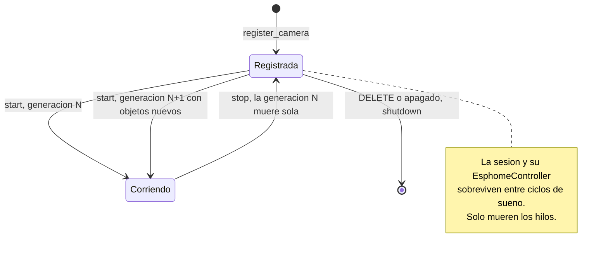
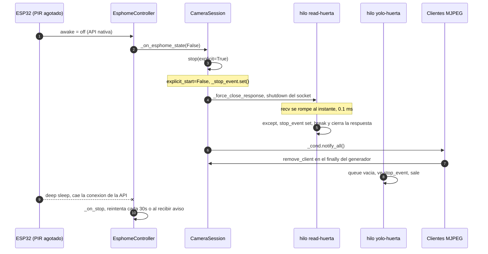
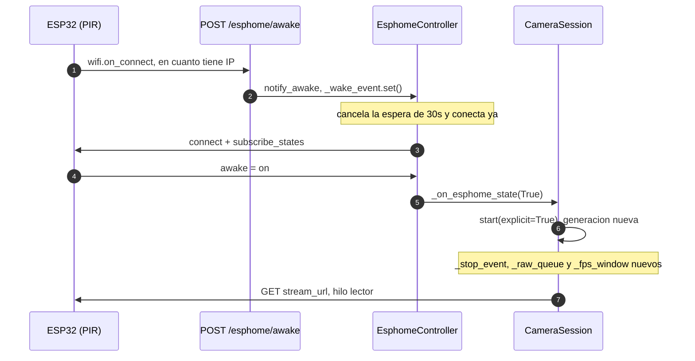

# Ciclo de vida de los objetos de `detect/main.py`

Quién crea cada instancia, cuánto vive, quién la destruye y qué recursos
suelta al morir. Complemento de [`ARQUITECTURA.md`](ARQUITECTURA.md), que
explica *qué hace* cada clase; esto explica *cuándo existe*.

El caso que más importa es el ciclo de sueño del ESP32: la placa está dormida
casi todo el tiempo y despierta por el PIR, así que las sesiones de cámara se
crean, paran y rearrancan constantemente. Si algo no se cerrara bien, el
servicio acumularía hilos, sockets y event loops hasta reventar.

Hay un test de regresión que cubre todo esto sin necesidad de la placa:

```powershell
cd detect
venv\Scripts\python.exe test\test_shutdown.py
```

---

## 1. Mapa de instancias

| Objeto | Cuántos | Lo crea | Lo destruye | Vive |
| --- | --- | --- | --- | --- |
| `GlobalConfig` (`GLOBAL_CONFIG`) | 1 | Import del módulo | Nunca | Todo el proceso |
| Modelos `YOLO` (`_loaded_models`) | 1 por `modelo+device` | `get_model()`, perezoso | **Nunca** (a propósito) | Todo el proceso |
| `CameraSession` | 1 por cámara registrada | `register_camera()` | `DELETE /cameras/{id}` o apagado | Entre alta y baja |
| `CameraConfig` | 1 por sesión | Pydantic al registrar | Con su sesión | Igual que la sesión |
| `EsphomeController` | 1 por sesión **con** `noise_psk` | `CameraSession.__init__` | `CameraSession.shutdown()` | Igual que la sesión |
| Hilos lector + proceso | 2 por **generación** | `CameraSession.start()` | `stop()` + fin natural | Un ciclo despierto |
| `requests.Response` | 1 por conexión del lector | `_read_loop` | `finally` del lector, o `stop()` | Una conexión al stream |
| Generador MJPEG | 1 por cliente HTTP | `mjpeg_generator()` | `finally` al cerrar el cliente | Una respuesta HTTP |

Punto clave: **una `CameraSession` sobrevive a los ciclos de sueño**. Lo que
nace y muere en cada ciclo son los *hilos* y la *conexión HTTP*, no la sesión
ni su `EsphomeController`.

---

## 2. Nivel proceso

### `GLOBAL_CONFIG`

Instancia única creada al importar el módulo. Solo se muta desde
`POST /config/keepalive`. No tiene cierre.

### Cache de modelos YOLO

`_loaded_models` no se vacía nunca, ni al borrar una cámara. Es deliberado:
cargar y precalentar un modelo cuesta segundos, y varias cámaras suelen
compartirlo. Consecuencia a tener presente: **la VRAM que ocupa un modelo no
se recupera al hacer `DELETE` de la última cámara que lo usaba**. Si algún día
molesta, el sitio para liberarlo es `remove_camera`, contando antes cuántas
sesiones vivas siguen usando esa clave.

### El keep-alive de GPU tiene fecha de caducidad

`_process_loop` lanza una inferencia dummy cada `keepalive_interval_sec`
(0,05 s) cuando la cola está vacía, para que el driver de la GTX 1080 no baje
de P-state entre frames y devuelva inferencias corruptas.

Eso **solo tiene sentido entre frames de un stream vivo**, en huecos de decenas
de milisegundos. Sin ese límite, una cámara desaparecida dejaba el hilo de
proceso lanzando 20 inferencias por segundo indefinidamente: medido con
`nvidia-smi`, **29 % de una GTX 1080 con cero frames entrando**, para siempre.

Tampoco tiene sentido **si no va a haber ninguna inferencia real que
proteger**: con `always_infer` a `false`, nadie mirando el stream y ningún
consumidor pidiéndolo, `model.track()` no llega a ejecutarse, así que calentar
la GPU no protege nada. Eran ~10 puntos de GPU gastados en reposo con la cámara
despierta. Por eso `_should_keepalive()` recibe también `has_inference`.

Ahora, pasados `keepalive_idle_limit_sec` (3 s, configurable en
`GLOBAL_CONFIG` y por `POST /config/keepalive`) sin un frame real, el
keep-alive se pausa y el `queue.get()` pasa a esperar 1 s en vez de 0,05 s, así
que el hilo queda de verdad en reposo. Medido: **29 % → 2 %**, con el reposo
del sistema en 4 %.

Al salir del reposo se lanza **una** dummy justo antes de la primera inferencia
real, para recalentar: así se conserva la garantía del workaround de P-state,
que es justo lo que el keep-alive protege. Va ahí, y no al recibir el frame,
porque cubre de una vez los dos motivos de haberse enfriado (sin frames o sin
inferencia pedida) y no calienta por un frame que no se va a inferir. Medido:
vuelve a 29 %.

La decisión vive en `_should_keepalive()`, una función pura precisamente para
poder probarla sin GPU.

### `lifespan`

- **Arranque:** `load_cameras_from_disk()` reconstruye las sesiones guardadas
  en `cameras_config.json`. Se crean paradas; las que tienen `noise_psk`
  levantan ya su `EsphomeController`, que empieza a intentar conectar.
- **Apagado:** `session.shutdown()` de todas **en paralelo**
  (`asyncio.gather`), cada una en un hilo (`asyncio.to_thread`) y con
  `timeout=5s`. Va en un hilo porque `shutdown()` hace `join()` y bloquear el
  event loop impedía a uvicorn cerrar las conexiones de clientes a tiempo.

---

## 3. `CameraSession`

### Nacimiento

`register_camera()` → `CameraSession(cfg)`. El constructor **no arranca
hilos**: solo prepara estado y, si hay `noise_psk`, crea el
`EsphomeController` (que sí arranca su hilo inmediatamente).

### Generaciones de hilos

Cada `start()` crea una **generación** nueva: objetos nuevos de `_stop_event`,
`_raw_queue` y `_fps_window`, más dos hilos nuevos (`read-<id>` y
`yolo-<id>`).

No se reciclan a propósito. Si `start()` hiciera `_stop_event.clear()` sobre
el mismo objeto, un hilo viejo que todavía no se hubiera enterado del `stop()`
anterior (bloqueado en `queue.get()`) despertaría, vería el evento ya limpio y
seguiría corriendo: dos generaciones vivas a la vez pisándose `_fps_window` y
publicando frames alternos. Con objetos nuevos, el hilo viejo sigue mirando
*su* evento —que sigue en `set()`— y se muere solo mientras la generación
nueva arranca limpia.

Por eso `_read_loop` y `_process_loop` copian `_stop_event` y `_raw_queue` a
variables locales en su primera línea: son la referencia a *su* generación.



### Muerte

Solo por `shutdown()`, desde `DELETE /cameras/{id}` o desde `lifespan`. Suelta,
en este orden:

1. `stop(explicit=True)` — señal de parada + cierre forzado de la conexión HTTP.
2. `esphome.shutdown(timeout=1.5)` — primero, para que deje de reintentar
   contra la placa y cierre su socket mientras los hilos de vídeo terminan.
3. `join()` de los dos hilos con un **deadline compartido de 2,5 s**.
4. `_cond.notify_all()` — despierta a cualquier generador que siguiera esperando.

---

## 4. `EsphomeController`

Nace con la sesión y **vive todo lo que viva la sesión**, incluso mientras la
placa está dormida: es precisamente quien tiene que enterarse de que ha
despertado.

Su hilo (`esphome-<ip>`) y su event loop propio se crean en el constructor y
solo se cierran en `shutdown()`.

### Reconexión mientras la placa duerme

Cuando la placa se duerme, cierra la conexión de la API nativa → `_on_stop` →
`_disconnected_event.set()` → el bucle reintenta. Cada intento se acota a
`connect_attempt_timeout_sec` (1 s); si falla, espera **hasta 30 s
pasivamente** o hasta que `notify_awake()` lo despierte antes. Cero polling
mientras está conectado.

Esto **no es una fuga**: es un único hilo dormido en un `await`, sin sockets
abiertos entre intentos.

### Cierre

`shutdown()` levanta los dos eventos que hacen salir a `_reconnect_loop` por
su propio pie y **espera al hilo**; el hilo cierra el socket y el loop en
`_close_loop()`, dentro de sí mismo.

> **Por qué así.** Antes `shutdown()` programaba `disconnect()` y acto seguido
> hacía `loop.stop()` desde fuera. El loop paraba antes de que la corrutina
> llegara a ejecutarse: el socket con la placa quedaba abierto hasta que moría
> el proceso —un descriptor filtrado por cada `DELETE` de cámara— y
> `run_until_complete` reventaba con *"Event loop stopped before Future
> completed"*, matando el hilo con un traceback por consola.

`shutdown()` es idempotente, y `notify_awake()` / `call_service()` comprueban
`_closed` antes de tocar el loop, así que llamarlos después no lanza nada.

> **Cuidado con los `clear()` de `_wake_event`.** Tras un intento de conexión
> fallido, `_reconnect_loop` hace `_wake_event.clear()` antes de esperar los
> `safety_retry_sec`. Si `shutdown()` acaba de levantar ese evento, el `clear()`
> se lo lleva por delante y el hilo se queda los **30 s** enteros esperando
> pese a estar parando — el `join(timeout=1.5)` expira y el loop nunca se
> cierra. Por eso justo después del `clear()` hay un `if self._stopping: break`:
> como `shutdown()` pone `_stopping` **antes** de programar el `set`, la ventana
> queda cerrada por los dos lados (si ganó el `clear()`, lo ve el `if`; si no,
> el `set` despierta al `wait`). Lo cazó el caso 4 de `test_shutdown.py`.

---

## 5. El ciclo de sueño, paso a paso

### La placa se duerme



El punto crítico es el paso 4. `stop()` lo llama **el event loop del
`EsphomeController`**, así que no puede bloquearse: si lo hace, ese hilo deja
de procesar estados y la reconexión se retrasa. Ver §6.

### La placa despierta



### Rearranque si la placa se duerme sin avisar

Si la placa cae sin llegar a publicar `awake=off` (corte de WiFi, batería), el
lector no puede reconectar. Cuando además el `EsphomeController` está
desconectado, el lector **deja de insistir** en vez de machacar una IP muerta
cada segundo.

Para que eso no deje la cámara muerta para siempre, `_on_esphome_state`
deduplica repeticiones solo si la sesión ya está como debería:

```python
if value == self._last_esphome_state and value == self.is_running:
    return
```

Así, un `awake=on` repetido al reconectar **sí** rearranca la sesión si la
lectura estaba parada. Antes se ignoraba por ser el mismo valor.

---

## 6. Cierre de la conexión HTTP con la cámara

Es el recurso más delicado: el hilo lector está bloqueado dentro de
`iter_content()` y hay que desbloquearlo desde otro hilo.

`resp.close()` **no vale por sí solo**. En Windows, cerrar el objeto fichero no
interrumpe el `recv()` en curso: medido en el test, `stop()` tardaba **12,23
segundos** en volver. Y como `stop()` lo llama el event loop del
`EsphomeController` y los endpoints `async`, ese bloqueo congelaba la API
entera durante esos 12 segundos, justo en el momento del apagado.

`_force_close_response()` hace `sock.shutdown(SHUT_RDWR)` sobre el socket
subyacente antes del `close()`. Eso rompe el `recv()` al instante (**0,1 ms**
medidos) y baja el `stop()` completo a **0,01 s**. El lector se despierta con
un `ChunkedEncodingError` que su propio `except` interpreta como parada.

Como llegar al socket depende de las tripas de `urllib3`, se prueban varias
rutas y, si ninguna funciona, el `close()` se delega a un hilo desechable: en
el peor caso el que se bloquea es ese y no quien pidió la parada.

### El `except` del lector es amplio a propósito

Cerrar la respuesta desde otro hilo hace saltar cosas distintas según dónde
pille a `urllib3`: a veces un `RequestException`, pero también
`ValueError("I/O operation on closed file")` o un `AttributeError` sobre un
socket ya puesto a `None`. Cazando solo `RequestException`, esos casos mataban
el hilo con un traceback en vez de salir por el camino limpio. Ahora es
`except Exception` y lo primero que mira es `stop_event`: si la parada estaba
pedida, la excepción es la consecuencia, no la causa.

---

## 7. El orden de apagado de uvicorn (y por qué importa)

`Server.shutdown()` (`uvicorn/server.py`) apaga en **tres pasos, en este
orden**:

1. Deja de aceptar conexiones nuevas.
2. **Espera a que terminen las respuestas en vuelo**, como mucho
   `--timeout-graceful-shutdown` segundos. Si expira, las cancela a la fuerza y
   loguea `Cancel N running task(s), timeout graceful shutdown exceeded`.
3. **Solo entonces** ejecuta el shutdown del `lifespan`, que es donde nosotros
   paramos las cámaras.

Esto crea un **bloqueo circular** con los streams MJPEG, que son bucles
infinitos: si un generador solo mirase `_stop_event`, no podría salir hasta el
paso 3, que no llega hasta que el paso 2 se rinde por timeout. Con clientes
conectados, cada Ctrl+C costaba los 5 s enteros y soltaba un `CancelledError`
por cliente.

La salida es que uvicorn instala sus handlers de señal **antes** de arrancar el
lifespan:

```python
async def serve(self, sockets=None):
    with self.capture_signals():    # <- handlers puestos aquí
        await self._serve(sockets)  # <- _serve -> startup() -> lifespan.startup()
```

Así que `_install_shutdown_signal_hook()`, llamado desde el arranque de nuestro
`lifespan`, se **encadena** a `Server.handle_exit`: levanta la bandera global
`_SHUTTING_DOWN` y luego delega. Los generadores miran `is_shutting_down()` y
salen en el "paso 0", así que el paso 2 termina enseguida.

Detalles que importan:

- **Es un `bool` de módulo, no un `threading.Event`.** Una asignación es
  atómica y segura desde un handler de señal; `Event.set()` coge un lock y no
  lo es del todo.
- **Hay que delegar en el handler previo.** Si nos comiéramos la señal,
  uvicorn no se enteraría del Ctrl+C y no se apagaría nunca.
- **Se encadenan las mismas señales que captura uvicorn**: `SIGINT`, `SIGTERM`
  y, en Windows, `SIGBREAK` (Ctrl+Break).
- El generador espera con `timeout=1.0` (no 5 s): es cada cuánto revisa las
  banderas si la cámara ha dejado de publicar frames. Con 5 s, un cliente
  pegado a una cámara parada podía tardar más que el propio
  `--timeout-graceful-shutdown` en enterarse.

Medido con dos streams abiertos: de 5 s + 2 `CancelledError` a **1,4 s y
ningún error**; ni siquiera llega a aparecer `Waiting for connections to
close`.

---

## 8. Presupuesto de tiempo al cerrar

uvicorn arranca con `--timeout-graceful-shutdown 5`, y `lifespan` da 5 s por
sesión. `CameraSession.shutdown()` se ajusta a eso:

| Paso | Tope |
| --- | --- |
| `stop()` + cierre forzado del socket | ~0,01 s |
| `esphome.shutdown()` (incluye `disconnect`) | 1,5 s |
| `join()` de los hilos lector y proceso | 2,5 s (deadline compartido) |
| **Total** | **~4 s** |

Latencia real de salida de cada hilo:

| Hilo | Sale en | Por qué |
| --- | --- | --- |
| Proceso (`yolo-*`) | ≤ 50 ms con keep-alive, ≤ 1 s sin él | Es el timeout de su `queue.get()` |
| Lector, dentro de `iter_content` | ~0,01 s | Le rompen el socket |
| Lector, dentro de `requests.get` | ≤ 3 s | Connect timeout contra una placa dormida |

Los tres hilos son **daemon**: si alguno se pasa del plazo se deja dicho en el
log, pero no impide que el proceso muera.

---

## 9. Recursos por cliente HTTP

Un generador MJPEG vive lo que dure la respuesta. `add_client()` al entrar,
`remove_client()` en un `finally`, así que un cliente que se va sin avisar
también descuenta.

Al irse el último cliente, `_maybe_autostop()` para la sesión **solo si** no
hay `explicit_start`. Con ESPHome, `explicit_start` lo pone el `awake=on`, así
que cerrar el navegador no apaga una cámara que el hardware dice que está
despierta.

Al revés, cuando la placa se duerme `stop()` corta **todas** las respuestas
MJPEG abiertas: los clientes ven terminar el stream y les toca reconectar.
Home Assistant lo hace solo.

No hay una cola por cliente: todos leen el mismo `_latest_*_jpeg`, así que un
cliente lento no acumula memoria, solo se salta frames.

---

## 10. Resumen de qué se suelta y qué no

**Se suelta correctamente:**

- Socket del stream MJPEG (`:8080`) — forzado al parar, y en el `finally` del lector.
- Socket de la API nativa (`:6053`) — `disconnect()` dentro del propio loop del controller.
- Event loop y hilo del `EsphomeController` — `loop.close()` en `_close_loop()`.
- Hilos lector y de proceso — salen por su propio `stop_event`.
- Contadores de clientes — `finally` en cada generador.

**No se suelta, a propósito:**

- Modelos YOLO en `_loaded_models` y su VRAM (cache compartida; ver §2).
- El `EsphomeController` mientras la placa duerme (es quien la espera).

**A vigilar si se toca el código:**

- Nada que se llame desde `_on_esphome_state` puede bloquear: corre en el
  event loop del controller.
- Nada bloqueante en un endpoint `async` sin `asyncio.to_thread` —
  `remove_camera` y `snapshot_camera` ya lo tuvieron y congelaban todos los
  streams a la vez.
- `asyncio.CancelledError` hereda de `BaseException`, no de `Exception`: un
  `except Exception` no la caza y se escapa del hilo.
- Cualquier respuesta de duración indefinida que se añada tiene que mirar
  `is_shutting_down()`, o volverá a bloquear el paso 2 del apagado (§7).
- Un `Event.clear()` puede borrar una señal de parada que acaba de llegar. Si
  se añade otro, comprobar `_stopping` justo después (ver §4).
- **Que muera un hilo no para la sesión.** Cuando `_read_loop` se rinde tiene
  que llamar a `stop()`, o el hilo de proceso se queda vivo quemando GPU con el
  keep-alive (§2). Y esa llamada debe ir guardada por
  `self._stop_event is stop_event`: sin esa comparación por identidad, un
  lector agonizante mataría a la generación **nueva** si ya hubiera arrancado
  otra (§3).

Los dos tests de `test/` cubren todo esto sin necesidad de las placas:
`test_shutdown.py` para las piezas sueltas y `test_shutdown_e2e.py` para el
apagado real de uvicorn con dos streams abiertos.

---

## 11. Dos avisos del log que son inofensivos

Ya investigados; **ninguno es nuestro** y ninguno indica una fuga.

### `OSError: [WinError 10038]` al final del todo

```
Exception ignored when trying to send to the signal wakeup fd:
  File "...\asyncio\runners.py", line 150, in _on_sigint
OSError: [WinError 10038] ... operación en un elemento que no es un socket
```

Lo provoca uvicorn **a propósito**: al terminar, `capture_signals` restaura los
handlers originales y **re-lanza** la señal capturada, para reproducir el
comportamiento que se esperaría:

```python
for captured_signal in reversed(self._captured_signals):
    signal.raise_signal(captured_signal)
```

En Windows, ese SIGINT re-lanzado hace que CPython escriba en el socket de
*signal wakeup fd* que el `Runner` de `asyncio.run` ya ha cerrado →
`WSAENOTSOCK`. Se imprime **después** de `Finished server process`, o sea con
todo ya cerrado, y lo escribe código C durante el manejo de la señal: **no se
puede capturar desde Python**. Solo aparece con Ctrl+C en una consola
interactiva; no con SIGTERM (Docker, servicios), y suele desaparecer en Python
3.12+.

### `Timezone resolution failed ... attached to a different loop`

```
192.168.1.56: Timezone resolution failed: Task <...get_timezone()...>
got Future <Future pending> attached to a different loop
```

`aioesphomeapi.timezone.get_timezone()` cachea un future **global**: el primer
`EsphomeController` lo crea en su event loop y el segundo intenta esperarlo
desde el suyo, que es distinto. Es consecuencia directa de nuestro diseño de
*un event loop por controller* (§4), y solo afecta a la caché de zona horaria,
que no usamos: las dos placas conectan igual (~660 ms medidos).

Aparece solo con **dos o más** cámaras con `noise_psk`. Si algún día molesta,
la solución sería un único hilo + loop compartido por todos los
`EsphomeController` en vez de uno por cada uno; es un refactor de cierto
tamaño y no arregla nada más, así que de momento se queda documentado.

*Documento generado con IA; revisar los valores antes de montar.*
