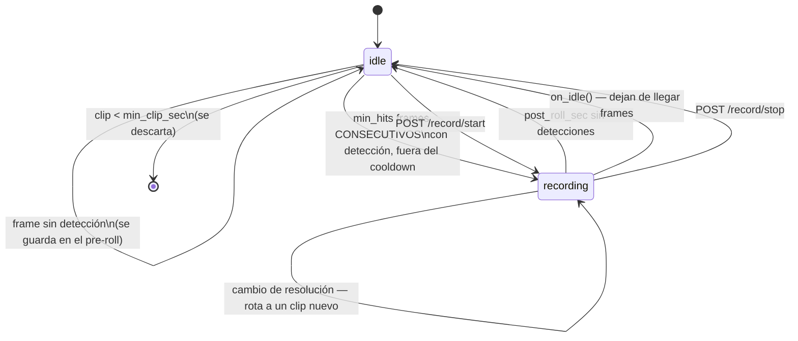

# Grabación de clips

El servicio puede guardar clips MP4 de lo que ven las cámaras: por detección de
YOLO o a mano por API, con unos segundos de **pre-roll** (vídeo anterior al
disparo), retención automática, y los ficheros servidos por HTTP para que Home
Assistant los liste y los reproduzca desde otra máquina.

Este documento explica por qué está hecho así y qué mirar cuando algo no cuadra.
La referencia de los endpoints está en Swagger (`http://<host>:8080/docs`), que
es la única interfaz del servicio.

---

## Por qué no se graba desde Home Assistant

La pregunta razonable es por qué no usar `camera.record`, que HA ya trae. Se
puede, declarando la cámara como `platform: ffmpeg` apuntando al stream del
servicio —`platform: mjpeg` no vale, no expone la *feature* `STREAM` y por tanto
no ofrece `camera.record`—. Pero sale peor en cuatro cosas:

| | Home Assistant | Este servicio |
| --- | --- | --- |
| Pre-roll | `lookback`, a costa de transcodificar MJPEG→HLS de forma **continua** en el host de HA | un `deque` de JPEG en memoria, coste casi cero |
| Retención | no existe; hay que montar un `shell_command` o un script aparte | por días y por GB, configurable por API |
| Saber qué se grabó | no lo sabe | el sidecar lleva las clases detectadas y la confianza máxima |
| Vídeo anotado | imposible | `source=annotated` graba las cajas de YOLO |

Así que la grabación vive en Python y **Home Assistant es solo consumidor**. No
hay carpeta compartida ni `/media`: HA está en otra máquina y habla por HTTP.

---

## Lo primero: comprobar que hay H.264

```
GET /recordings/capabilities
```

Si `h264` viene a `false`, **los clips no se verán en Home Assistant**. Este es
el fallo más caro de diagnosticar de toda la grabación, porque no da ningún
error: el fichero pesa lo suyo, VLC lo abre tan contento, y en el navegador o en
la app de HA se ve un reproductor en negro.

El motivo es que los navegadores solo reproducen H.264, H.265, VP9 y AV1. El
`mp4v` que produce `cv2.VideoWriter` por defecto en Windows es MPEG-4 Part 2, que
no está en esa lista. Y el FFmpeg que trae `opencv-python` es LGPL, así que **no
puede codificar H.264**: al pedirle `avc1` devuelve un writer muerto sin lanzar
ninguna excepción.

La solución es el paquete `imageio-ffmpeg`, que ya está en `requirements.txt` y
trae un `ffmpeg.exe` con `libx264`:

```
venv\Scripts\python.exe -m pip install imageio-ffmpeg
```

| Encoder | Reproducible en HA | Coste | Dependencia |
| --- | --- | --- | --- |
| `ffmpeg` + libx264 | **sí** | **no decodifica nada en Python** (los JPEG se le pasan tal cual por la tubería) | `imageio-ffmpeg` o un ffmpeg en el PATH |
| OpenCV `avc1` | sí | `imdecode` + codificación | un `openh264-*-win64.dll` junto a `cv2` |
| OpenCV `mp4v` | **no** | `imdecode` + codificación | ninguna |

Cuando toca caer en `mp4v`, el servicio lo avisa en el log y marca el clip con
`playable_in_browser: false` en su sidecar y en `/status`, en vez de dejar que se
descubra días después.

Un detalle más del camino de ffmpeg: se fuerza `-pix_fmt yuv420p`. El MJPEG del
ESP32 es 4:2:2 y, sin forzarlo, x264 produce un H.264 `yuv422p` perfectamente
válido que ningún navegador decodifica — mismo síntoma que el `mp4v` y todavía
más difícil de achacar.

---

## Puesta en marcha

```
POST /cameras/huerta/config/recording
    source=raw
    trigger_classes=14,15,16      (pájaro, gato, perro)
    pre_roll_sec=5
    post_roll_sec=10
```

Esa primera llamada es la que **monta** la grabación: al dar de alta una cámara
no se pide, igual que pasa con los servos. Se persiste en `cameras_config.json`,
así que sobrevive a un reinicio.

Casi todo se aplica en caliente porque la configuración se relee en cada frame.
Las excepciones son `source`, `encoder` y `fourcc`, que los lee el hilo escritor
al abrir el fichero: si se cambian a media grabación, surten efecto en el clip
siguiente.

### `source`: la decisión que cuesta GPU

- `source=annotated` graba el vídeo con las cajas y las etiquetas de YOLO
  pintadas. Es lo que se quiere para revisar una detección. **Enciende la
  inferencia** en esa cámara aunque no haya nadie mirando el stream (~29 % de una
  GTX 1080 con `yolo26m`), porque dibujar implica inferir.
- `source=raw` graba la imagen limpia y **no cuesta GPU ninguna**. Es la opción
  para grabar mucho, o para una cámara que solo sirva vídeo.

Con dos cámaras grabando en `annotated` la GPU se satura. Merece la pena pensarlo
antes de dejarlo puesto.

### Disparo manual

```
POST /cameras/huerta/record/start   (opcionalmente note=...)
POST /cameras/huerta/record/stop
```

El clip incluye el pre-roll que hubiera acumulado, así que pulsar al oír algo ya
recoge los segundos anteriores. `start` **espera a que llegue un frame** antes de
responder: si contesta 200, está grabando de verdad; si la cámara está dormida o
parada, devuelve 503 en vez de quedarse armado en silencio.

Si ya había un clip abierto por detección, el manual **lo adopta** en vez de
partirlo en dos: cortar justo cuando el usuario pulsa perdería el trozo por el
que ha pulsado. Y mientras el clip es manual no se cierra por `post_roll_sec`,
solo con `stop` o al llegar a `max_clip_sec`.

---

## Cómo decide cuándo grabar



Tres detalles que no son obvios:

- **`min_hits` cuenta frames consecutivos**, no frames sueltos. A 1, una hoja
  movida que YOLO ve como un pájaro durante un frame ya genera un fichero; a 2
  hay que fallar dos veces seguidas en el mismo sitio. Por defecto 2.
- **`on_idle()` también cierra.** Si la placa se duerme o pierde el wifi a media
  grabación, sin esto el clip se quedaría abierto hasta el próximo evento y
  saldría un fichero con dos sucesos de horas distintas pegados.
- **`max_clip_sec` rota, no para.** Si el evento sigue, se cierra el fichero y el
  siguiente frame abre el que lo continúa. Evita el MP4 de 8 GB de una cámara
  enfocando una carretera.

### El pre-roll

Es el motivo de existir de todo esto. Un clip que empieza cuando YOLO ya ha
reconocido al gato empieza con el gato a medio salir del encuadre.

Se guardan los últimos `pre_roll_sec` segundos de JPEG en memoria y se vuelcan al
clip en cuanto salta el disparo. Se poda por segundos **y** por megabytes: el fps
del pipeline es variable (la misma cámara da 15 fps de cerca y 4 con mala señal),
y a 1600×1200 los mismos cinco segundos ocupan diez veces más.

Memoria aproximada a 640×480 (JPEG de ~45 KB):

| pre-roll | 10 fps | 15 fps | 25 fps |
| --- | --- | --- | --- |
| 3 s | 1,4 MB | 2,0 MB | 3,4 MB |
| 5 s | 2,3 MB | 3,4 MB | 5,6 MB |
| 10 s | 4,5 MB | 6,8 MB | 11,3 MB |

El tope duro es `preroll_max_mb` (32 MB por defecto).

---

## Por qué no frena la inferencia

Todos los métodos de un `DetectionConsumer` corren en el hilo `yolo-<camera_id>`,
el mismo que hace la inferencia y alimenta a quien esté mirando el stream. Un
`VideoWriter.write()` o un `subprocess` ahí dentro le metería al pipeline entero
la latencia del disco en cada frame.

Así que lo que hace el grabador en el hilo de la cámara es **exclusivamente
O(1)**: apuntar el JPEG en el pre-roll y encolarlo. Un hilo escritor por cámara
(`rec-<camera_id>`) saca de la cola y es el único que toca el encoder y el disco.

**Si la cola se llena se descarta el frame nuevo**, nunca se bloquea. Y se
descarta el nuevo, no el viejo: en un fichero que se lee de principio a fin,
tirar el viejo descolocaría el orden temporal, mientras que tirar el nuevo solo
mete un salto y el clip sigue siendo coherente. El contador sale en
`dropped_frames`: **si sube, el disco no da abasto**.

### De dónde salen los frames

De los JPEG que la sesión ya ha codificado, no del ndarray. A 640×480 un frame en
crudo son ~0,9 MB y en JPEG ~45 KB: un pre-roll de cinco segundos pasa de 69 MB a
3,4 MB por cámara. Y con ffmpeg esos JPEG se le pasan tal cual, así que no se
decodifica ni un frame en todo el camino.

El pipeline solo codifica JPEG cuando alguien va a leerlos, así que el grabador
tiene que pedirlo. Lo hace con `wants_frames()`, el gemelo de `wants_inference()`
para la codificación — **no** registrándose como cliente de stream. Esto último
sería lo obvio y está mal: `client_count` gobierna el arranque y la parada de la
sesión y la lógica de reconexión, así que un "cliente" interno permanente dejaría
la cámara reintentando en bucle contra una placa dormida, que es justo el fallo
que ese código evita.

Con `enabled=false` el coste vuelve a ser **exactamente cero**: ni pre-roll, ni
un `imencode` de más.

### El fps del fichero

Un MP4 puede ser de fps variable, pero ni `VideoWriter` ni `image2pipe` dejan
poner el PTS de cada frame sin complicarlo mucho. Así que el fps se **fija al
abrir el clip** (el configurado, o el medido del pipeline, o 12) y la deriva se
corrige repitiendo frames en el hilo escritor: si entre dos frames ha pasado más
que un periodo del fichero, se repite el anterior. A x264 un frame idéntico le
sale casi gratis.

Sin esto, veinte segundos de evento a 4 fps saldrían como un clip de cinco
segundos acelerado.

---

## Los ficheros en disco

```
detect/clips/                                 <- root_dir, configurable
  huerta/2026-09-20/
    huerta_20260920-181233_det.mp4            el vídeo
    huerta_20260920-181233_det.json           los metadatos (sidecar)
    huerta_20260920-181233_det.jpg            la miniatura
    huerta_20260920-190002_det.part.mp4       en curso; invisible para la API
```

El sufijo es `det` (detección) o `man` (manual), y la fecha va en formato
ordenable y en hora local, la misma del log del servicio, para poder cotejar clip
y log a ojo.

**Mientras se graba el fichero es un `.part.mp4`** y al cerrar se renombra de
forma atómica. Eso resuelve tres cosas de golpe: el listado nunca ofrece un
fichero a medias, la retención nunca borra el clip en curso, y Home Assistant no
se descarga un MP4 sin índice.

El **sidecar JSON** existe para que listar no tenga que abrir ni un solo MP4:
`GET /recordings` sale de leer JSON pequeños, no de demuxar vídeo. Lleva
`trigger`, `started_at`/`ended_at`, `duration_sec`, `frames`, `dropped_frames`,
`fps`, `width`/`height`, `source`, `encoder`, `playable_in_browser`, `bytes`,
`labels` (conteo por clase) y `max_conf`.

La **miniatura** es el JPEG que disparó el clip, guardado tal cual: no cuesta
codificar nada y le da a HA una imagen para la tarjeta sin abrir el vídeo.

Si el servicio se muere a lo bruto, los `.part` que queden se rescatan en el
siguiente arranque: los que tienen contenido se renombran a `…-truncado.mp4` y
los vacíos se borran. Un `.part` con datos es vídeo de verdad al que solo le
falta el cierre del contenedor, y suele ser justo el clip del incidente que tumbó
el servicio.

### Retención

```
GET  /recordings/stats     cuánto ocupa y cuánto disco queda
POST /recordings/config    max_age_days, max_total_gb, min_free_gb
POST /recordings/sweep     dry_run=true para ver qué borraría
```

Un hilo global (`clip-retention`) borra primero lo caducado por edad y después,
sobre lo que queda, los **más antiguos** hasta bajar del tope de tamaño. En ese
orden a propósito: al revés se borrarían clips recientes para hacer hueco a otros
que iban a caducar en la misma pasada. Barre al arrancar, cada
`sweep_interval_sec` y justo después de cerrar cada clip.

`min_free_gb` (2 GB por defecto) es la red de seguridad: por debajo de ese hueco
libre **no se abren clips nuevos**. La retención borra lo viejo, pero si el disco
se llena por otra cosa más vale dejar de grabar que tumbar el servicio donde
también corre YOLO.

Antes de bajar `max_age_days` o `max_total_gb`, conviene ver qué se lleva por
delante con `POST /recordings/sweep` y `dry_run=true`.

---

## Desde Home Assistant

HA corre en otra máquina, así que consume los clips por HTTP. El último clip de
una cámara:

```yaml
sensor:
  - platform: rest
    name: Huerta último clip
    resource: "http://<host>:8080/recordings?camera_id=huerta&limit=1"
    value_template: "{{ value_json.clips[0].clip_id if value_json.clips else 'ninguno' }}"
    json_attributes_path: "$.clips[0]"
    json_attributes: [clip_id, url, thumbnail_url, trigger, started_at, duration_sec, labels]
    scan_interval: 60
```

Y una notificación con el vídeo, disparada cuando cambie ese sensor:

```yaml
automation:
  - alias: Aviso de clip nuevo en la huerta
    trigger:
      - platform: state
        entity_id: sensor.huerta_ultimo_clip
    action:
      - service: notify.movil
        data:
          message: >-
            Movimiento en la huerta:
            {{ state_attr('sensor.huerta_ultimo_clip', 'labels') }}
          data:
            video: >-
              http://<host>:8080{{ state_attr('sensor.huerta_ultimo_clip', 'url') }}
            image: >-
              http://<host>:8080{{ state_attr('sensor.huerta_ultimo_clip', 'thumbnail_url') }}
```

Grabar desde una automatización de HA (por ejemplo al dispararse el PIR) es un
`rest_command` contra el disparo manual:

```yaml
rest_command:
  huerta_grabar:
    url: "http://<host>:8080/cameras/huerta/record/start"
    method: post
    content_type: "application/x-www-form-urlencoded"
    payload: "note=PIR"
  huerta_parar_grabacion:
    url: "http://<host>:8080/cameras/huerta/record/stop"
    method: post
```

La descarga admite cabeceras `Range` (lo aporta Starlette), que es lo que
permite al reproductor hacer *seek* sin bajarse el clip entero.

> **Aviso de seguridad.** El servicio **no tiene autenticación**, ni este
> endpoint ni ningún otro. Con la grabación activada, cualquiera que alcance el
> puerto `:8080` puede listar y descargarse el vídeo de la parcela. Esto solo
> debe vivir en la LAN: no abras ese puerto a Internet ni lo expongas por un
> túnel sin poner un proxy con autenticación delante.

---

## Qué mirar cuando algo va mal

| Síntoma | Dónde mirar |
| --- | --- |
| El vídeo se ve en negro en HA | `GET /recordings/capabilities` → `h264: false`. Instala `imageio-ffmpeg`. |
| El clip tiene saltos | `dropped_frames` en `/cameras/{id}/record/status`. El disco no da abasto, o el encoder está a `preset` demasiado lento. |
| No graba nada | `state`, `enabled` y `disk_ok` en `/record/status`. Y que la cámara esté arrancada: sin frames no hay clip. |
| Graba de más | `min_hits` a 1, o `min_conf` muy bajo, o `trigger_classes` vacío (dispara con cualquier clase). |
| Un evento sale partido en varios clips | `post_roll_sec` más corto que las pausas del bicho. Súbelo. |
| Se borran clips antes de tiempo | `GET /recordings/stats` → `config` y `last_sweep`. Probablemente el tope de `max_total_gb`. |
| La GPU va al 100 % | `source=annotated` enciende la inferencia. Pásalo a `raw` si no necesitas las cajas en el vídeo. |

---

## Tests

```
venv\Scripts\python.exe test\test_clips.py          almacén y retención
venv\Scripts\python.exe test\test_recorder.py       la máquina de estados
venv\Scripts\python.exe test\test_recording_api.py  el contrato HTTP
venv\Scripts\python.exe test\test_encoder_smoke.py  codifica un MP4 de verdad
```

Los tres primeros no necesitan ffmpeg, ni GPU, ni placa: el grabador recibe el
almacén y el encoder inyectados. El último sí codifica, y si en la máquina no hay
H.264 imprime `SKIP` y sale con 0 en vez de romper por el entorno.

Tras tocar el pipeline conviene pasar también `test_servo_tracker.py` y
`test_shutdown.py`, que son los que cazan una regresión en `camera.py`.

*Documento generado con IA; revisar los valores antes de montar.*
