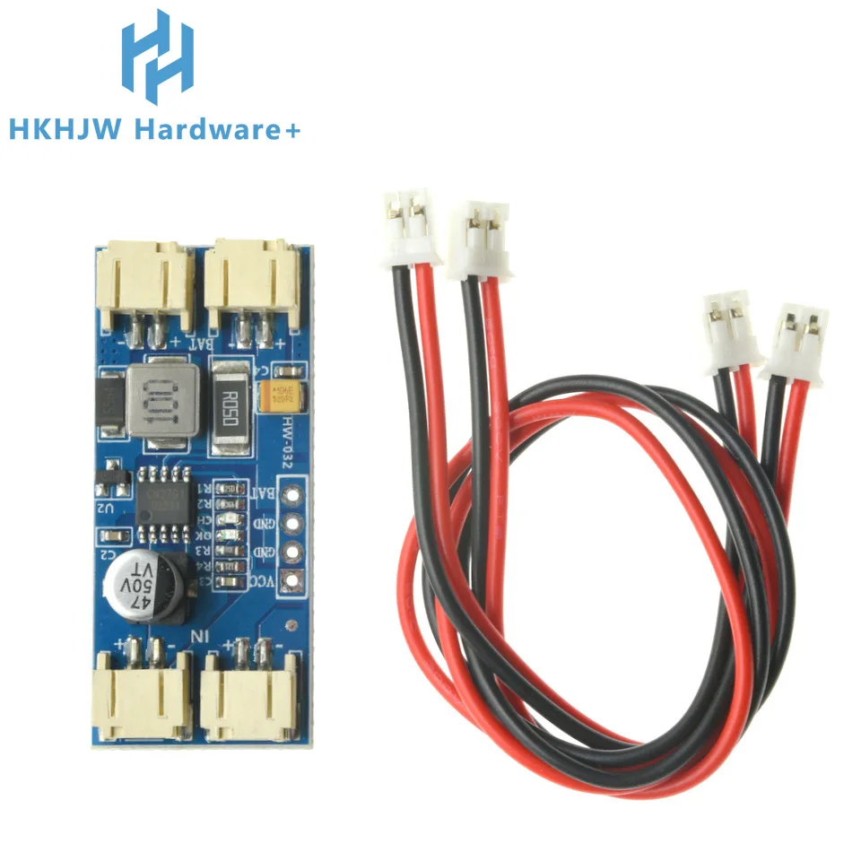

# Módulo cargador solar MPPT CN3791 (HW-832)

Ficha de referencia del módulo de carga solar pensado para el nodo exterior a
batería + panel solar ("espantapájaros" / water-tower-defense, ver
[`README.md`](../../README.md)). Todavía no está cableado en ningún YAML del
proyecto — es la pieza de alimentación prevista para cuando `huerta.yaml` deje
de depender solo de batería. Imagen original en
[`img/CN3791.webp`](img/CN3791.webp) (ficha del vendedor HKHJW Hardware+, sin
URL propia guardada).

## Identificación

- **Chip principal:** **CN3791** — controlador de carga solar con **MPPT**
  (Maximum Power Point Tracking) integrado, de Consonance Electronic.
- **Placa:** módulo genérico serigrafiado "HW-832".
- **Función:** carga una batería **Li-ion/LiPo de una celda (3.7V)** desde un
  panel solar, ajustando el punto de trabajo del panel para maximizar la
  energía extraída en vez de limitarse a un cargador lineal fijo.
- **Corriente de carga:** configurable por resistencia de sensado (R1-R4 en el
  PCB); el CN3791 soporta hasta ~3A según la resistencia usada, pero módulos
  de este tamaño suelen limitarse a ~1-2A.

## Conectores del módulo

| Conector       | Función                                                        |
| -------------- | ---------------------------------------------------------------- |
| `IN` (x2, +/-) | Entrada del **panel solar** (dos tomas JST redundantes/en paralelo) |
| `BAT` (x2, +/-)| Salida a la **batería** Li-ion/LiPo 1S (dos tomas JST redundantes/en paralelo) |
| `VCC`          | Salida auxiliar (tensión de batería, para alimentar lógica externa) |
| `CH`           | Salida de **estado de carga** (indica si está cargando, normalmente drenaje abierto o nivel lógico) |
| `GND` (x2)     | Masa común, junto a `VCC` y `CH` en el header de 4 pines          |

Componentes visibles en el PCB: bobina de potencia, diodo Schottky, MOSFET de
conmutación, condensador electrolítico de salida (47µF/50V), y un segundo chip
("U2", probablemente un amplificador operacional o comparador auxiliar) junto
a las resistencias de sensado R1-R4 que fijan la corriente de carga.

## Notas de integración con el proyecto

- Pensado para alimentar el nodo `huerta.yaml` (ESP32-S3 + cámara + PIR) de
  forma autónoma: panel solar → `CN3791` (MPPT) → batería 1S → regulador
  **TPS63020** (ver [`tps63020-buck-boost.md`](tps63020-buck-boost.md)) → 5V
  para la placa ESP32-S3-CAM.
- La salida `CH` (estado de carga) podría leerse desde un GPIO libre del
  ESP32-S3 para exponer un sensor de diagnóstico "cargando/no cargando" en
  Home Assistant, si se decide instrumentarlo — no implementado todavía.
- Al ser una celda 1S (3.7-4.2V), la tensión de batería no es directamente
  utilizable por la placa ESP32-S3-CAM (necesita 5V vía USB-C/TTL o un
  regulador a su entrada de 5V), de ahí la necesidad del buck-boost.

---

*Documento de referencia de hardware, generado a partir de la captura del
vendedor en [`img/CN3791.webp`](img/CN3791.webp). Componente aún no cableado
en ningún YAML del proyecto.*
