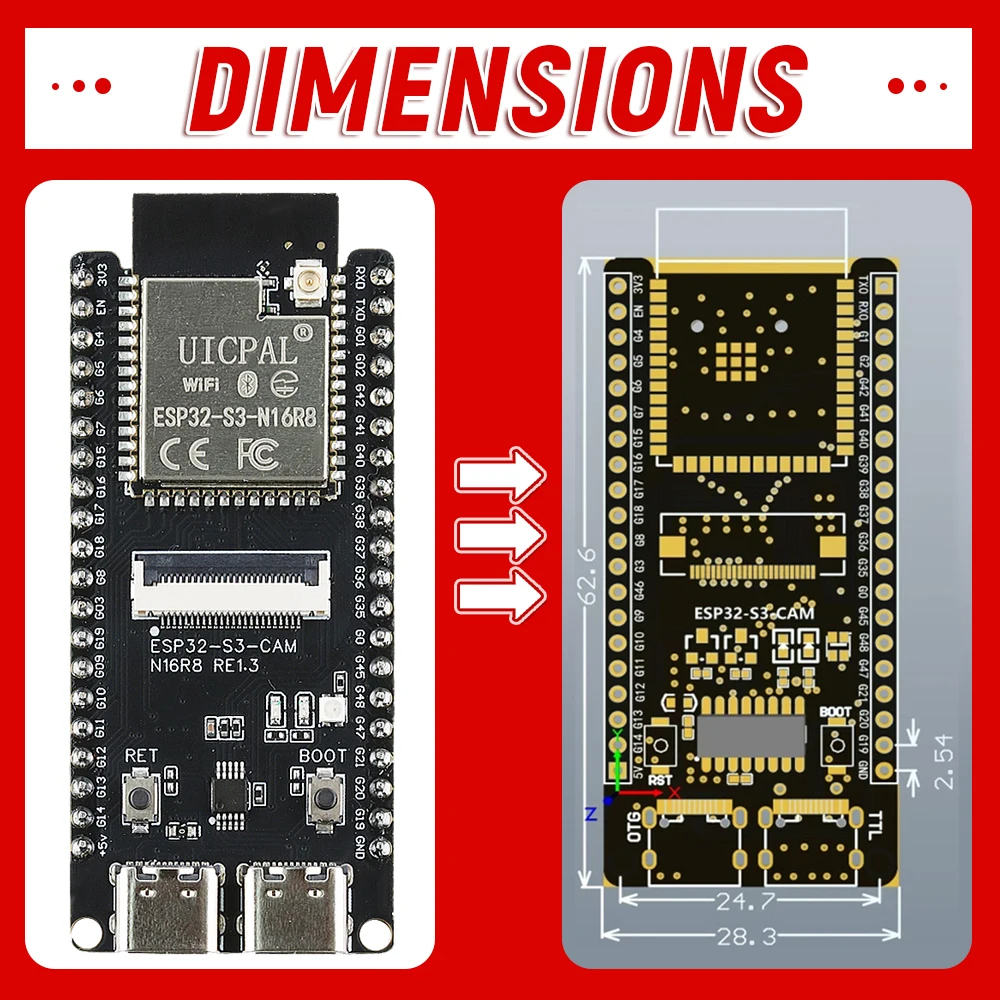
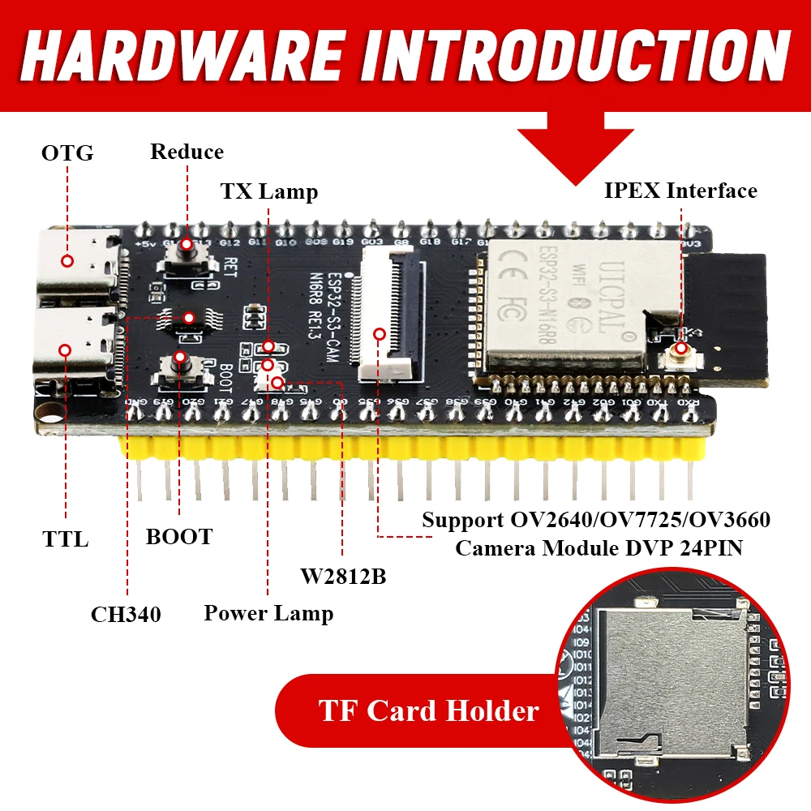
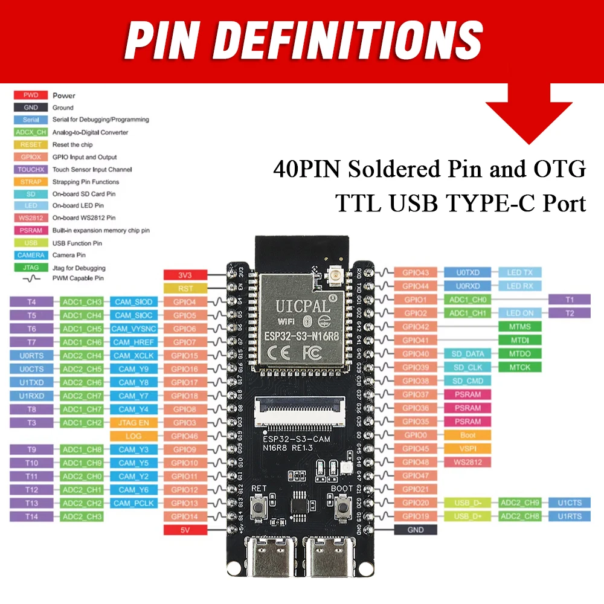
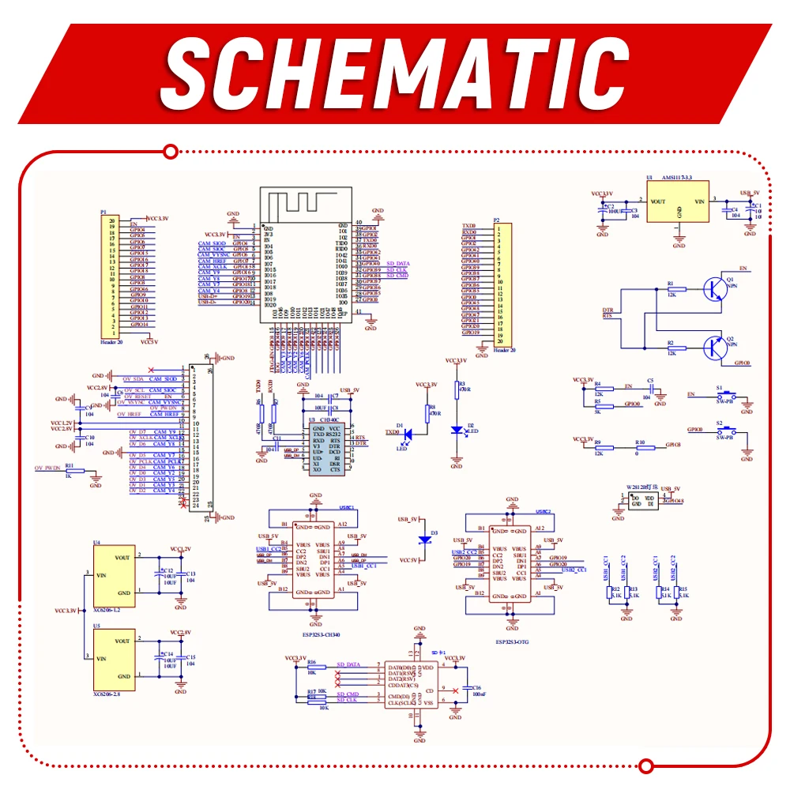
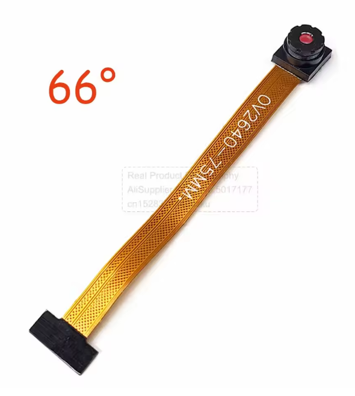

# Placa UICPAL ESP32-S3-CAM (N16R8)

Ficha de referencia de la placa física usada por `esp32-s3-cam.yaml`,
`esp32-s3-cam-servo.yaml` y `huerta.yaml`. Las imágenes originales están en
[`img/esp32/`](img/esp32/) (capturas de la ficha del vendedor, sin URL propia
guardada).

## Identificación

- **Nombre comercial:** UICPAL ESP32-S3-CAM
- **Módulo:** ESP32-S3-N16R8 — Wi-Fi + BLE, 16MB de flash, 8MB de PSRAM octal
- **PCB:** serigrafiado como "ESP32-S3-CAM N16R8 RE1.3"
- **Dimensiones:** 62.6 × 28.3mm, pines a 2.54mm de paso, 40 pines en total (doble hilera lateral)



## Hardware Introduction



- **2× USB-C:**
  - **TTL** — puerto serie por chip **CH340**, usado para el primer flasheo y para
    ver logs por USB.
  - **OTG** — USB nativo del ESP32-S3, independiente del CH340.
- **Botones:** `RET` (reset) y `BOOT`.
- **LEDs:** power, "TX lamp" (actividad serie) y un LED direccionable **WS2812B**.
- **Cámara:** conector **FPC de 24 pines** (no IPEX), compatible con sensores
  **OV2640 / OV7725 / OV3660**.
- **Antena:** conector **IPEX** para antena Wi-Fi externa.
- **Almacenamiento:** ranura para tarjeta **microSD** (TF card).

## Pinout usado por el proyecto



De los 40 pines disponibles, esto es lo que ya consumen los YAML del proyecto
(coincide exactamente con la tabla de la imagen):

| Función                  | Pin     | Alias en la serigrafía |
| ------------------------ | ------- | ----------------------- |
| Cámara D0                | GPIO11  | CAM_Y4                  |
| Cámara D1                | GPIO9   | CAM_Y3                  |
| Cámara D2                | GPIO8   | CAM_Y2                  |
| Cámara D3                | GPIO10  | CAM_Y5                  |
| Cámara D4                | GPIO12  | CAM_Y6                  |
| Cámara D5                | GPIO18  | CAM_Y7                  |
| Cámara D6                | GPIO17  | CAM_Y8                  |
| Cámara D7                | GPIO16  | CAM_Y9                  |
| XCLK (reloj de cámara)   | GPIO15  | LOG                      |
| VSYNC                    | GPIO6   | CAM_VYSNC                |
| HREF                     | GPIO7   | CAM_HREF                 |
| PCLK                     | GPIO13  | CAM_PCLK                 |
| I2C SDA (control sensor) | GPIO4   | CAM_SIOD                 |
| I2C SCL (control sensor) | GPIO5   | CAM_SIOC                 |

El resto de GPIO (incluyendo los que usa `esp32-s3-cam-servo.yaml` para los
servos pan/tilt) quedan libres en la placa para variantes futuras — en línea
con la práctica del proyecto de una placa física = un YAML propio en vez de
condicionales acumulados en uno solo.

## Esquemático



Bloques relevantes:

- **USB-TTL (CH340):** auto-reset del ESP32-S3 mediante dos transistores que
  traducen DTR/RTS del CH340 a `EN`/`GPIO0`, igual que en un DevKit estándar.
- **USB-OTG:** puerto USB-C independiente cableado directamente a los pines
  USB nativos del S3 (GPIO19/GPIO20), sin pasar por el CH340.
- **Alimentación del sensor de cámara:** dos reguladores **XC6206** dedicados
  (2.8V y 1.2V) para las tensiones que exigen los sensores OV26xx/OV37xx/OV77xx.
- **Alimentación de lógica principal:** regulador **AMS1117-3.3** desde la
  entrada de 5V (USB o pin `5V`). Su salida es el nodo `VCC3.3V`, del que
  cuelgan el módulo ESP32-S3 **y la entrada de los dos XC6206** de la
  cámara; el header P1 expone ese nodo en el pin `3V3` (junto a `5V`).
- **Alimentación a batería por `3V3`:** en el nodo autónomo la placa se
  alimenta metiendo 3.3V regulados directamente por el pin `3V3` desde el
  [TPS63020](tps63020-buck-boost.md), saltándose el AMS1117. Por ese pin
  queda alimentado todo lo necesario (ESP32-S3 y cámara); lo único que se
  queda sin tensión es el CH340 y el LED WS2812B, que cuelgan de `USB_5V`.
  Para flashear por USB-TTL hay que deshabilitar antes el TPS63020 — ver
  las precauciones en su ficha.

## Sensor de cámara: OV2640



La placa acepta OV2640/OV7725/OV3660 (ver "Hardware Introduction" arriba),
pero el módulo que usa este proyecto es concretamente un **OV2640** en un
cable **FPC de 75mm** terminado en el conector de **24 pines** que encaja en
el socket de la placa, con lente de **66° de campo de visión (FOV)** — dato
serigrafiado en el propio cable junto con "OV2640-75MM".

- **Sensor:** OmniVision **OV2640**, CMOS de **2 megapíxeles**, óptica de
  1/4", píxel de 2.2×2.2µm.
- **Resolución máxima:** **UXGA (1600×1200)** — coincide exactamente con la
  opción más alta configurada en `resolution:` de `esp32-s3-cam.yaml` y
  `esp32-s3-cam-servo.yaml`.
- **Salida:** JPEG comprimido en el propio sensor (además de YUV422/RGB565
  crudos), lo que le quita trabajo de compresión a la ESP32-S3 — es lo que
  aprovecha `esp32_camera_web_server` para servir el stream MJPEG sin gastar
  CPU en volver a comprimir cada frame.
- **Control:** interfaz **SCCB** (compatible I2C), la misma que usa el
  proyecto por `i2c_bus` (`GPIO4`/`GPIO5`) para ajustar exposición, ganancia
  y resolución en runtime desde las entidades de Home Assistant.
- **Framerate:** hasta ~15fps a máxima resolución (UXGA), bastante más a
  resoluciones menores (QVGA/VGA) — coherente con el límite de 30fps que
  pone como techo el number "Cam Max Framerate" del YAML.
- **Óptica de este módulo en concreto:** **66° de FOV**, un ángulo medio
  (ni gran angular ni teleobjetivo); existen variantes del mismo OV2640 con
  otros FOV (60°/72°/160° gran angular) en el mismo formato de cable y
  conector, así que el ángulo de visión real depende de qué módulo físico se
  monte, no del sensor en sí.

## Correspondencia con los YAML del proyecto

| YAML                        | Usa esta misma placa física |
| --------------------------- | ---------------------------- |
| `esp32-s3-cam.yaml`         | Sí — cámara-proxy permanente |
| `esp32-s3-cam-servo.yaml`   | Sí — añade 2 servos pan/tilt |
| `huerta.yaml`                | Sí — añade PIR + deep sleep  |

En los tres, la config genérica de ESPHome que representa esta placa es:

```yaml
esp32:
  board: esp32-s3-devkitc-1
  variant: esp32s3
  flash_size: 16MB
psram:
  mode: octal
  speed: 80MHz
```

---

*Documento de referencia de hardware, generado a partir de las capturas del
vendedor en [`img/esp32/`](img/esp32/) y contrastado con los valores reales de
pines de `esp32-s3-cam.yaml`.*

*Documento generado con IA; revisar los valores antes de montar.*
