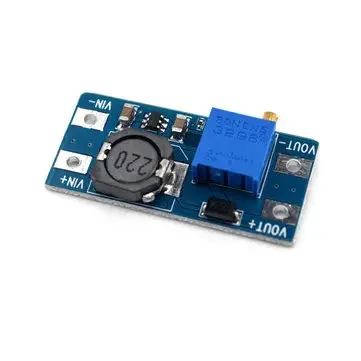

# Módulo elevador de tensión MT3608 (2A)

Ficha de referencia del módulo boost que el usuario ya tiene disponible como
alternativa/complemento al [TPS63020](tps63020-buck-boost.md) en la cadena
de alimentación del nodo solar (ver README, "water-tower-defense").

## Identificación

- **Chip principal:** **MT3608** — convertidor **boost puro** (solo eleva
  tensión, no puede bajarla), frecuencia de conmutación 1.2MHz.
- **Entrada:** 2-24V. **Salida:** 5-28V, **ajustable por potenciómetro**
  (trimpot) en la propia placa — a diferencia del TPS63020, que fija la
  salida por puente de soldadura entre pads (3V3/4V2/5V), aquí hay que
  **ajustar la salida a mano con un multímetro antes de conectar cualquier
  carga**: de fábrica el trimpot puede estar en cualquier posición, incluida
  una que dé mucho más de 5V.
- **Corriente:** anunciado como "2A" en la placa/anuncio, cifra que en la
  práctica hay que tomar con mucha cautela (ver más abajo).
- **Diferencia clave frente al TPS63020:** al ser boost puro, **solo
  funciona si la entrada es siempre menor que la salida deseada**. Para este
  proyecto no es un problema: la batería Li-ion 1S (3.0-4.2V) nunca supera
  los 5V, así que nunca hay que "bajar" tensión y el MT3608 cubre el caso de
  uso completo igual que el TPS63020 — sin necesitar su capacidad de
  buck-boost.

## Cuánto da en la práctica

Igual que con el TPS63020, el "2A" del rótulo es optimista. Pruebas
independientes con este módulo muestran:

- La **eficiencia es mejor entre 0.5A y 1A**; cae al acercarse a los 2A
  anunciados ([revisión detallada](https://mt3608stepupmodule.wordpress.com/mt3608-2-amp-step-up-dc-dc-converter-module/)).
- En una prueba forzando el módulo a 12V/2A con una tira de LEDs, a los 30
  segundos **se recalentó, la tensión de salida cayó a 8.7V** y la carga
  empezó a fallar.
- Otro test no logró superar de forma estable **~750mA a 10V de salida**
  sin que la regulación térmica degradara la tensión de salida.
- El propio datasheet fija la protección térmica en ~155°C — el chip se
  autoprotege, pero antes de llegar ahí la tensión ya se ha hundido y ha
  dejado de ser una fuente fiable.

**Conclusión práctica:** igual que con el TPS63020 (ver esa ficha para el
caso real documentado ahí), no dar por buena la cifra de "2A" — para
presupuestar con margen, tratar este módulo como bueno hasta **~0.8-1A**
sostenidos, no más.

## Rol en el proyecto

> **Alternativa descartada.** El reparto final adoptado es TPS63020 a 3.3V
> para la lógica + [TPS61088](tps61088-boost-converter.md) a 5V para los
> servos (ver [`step-up-boost-comparativa.md`](step-up-boost-comparativa.md)).
> Lo que sigue se conserva como referencia de la opción con MT3608.

Dado que ambos módulos ([TPS63020](tps63020-buck-boost.md) y este MT3608)
rondan realísticamente el mismo techo de corriente utilizable (~1-1.5A),
tiene sentido usarlos como **dos rieles de 5V independientes** en vez de
sobrecargar uno solo con toda la torreta:

- **TPS63020** → lógica y cámara (ESP32-S3-CAM), que es una carga más
  constante y predecible.
- **MT3608** → servos de la torreta (ver
  [`servos-pan-tilt.md`](servos-pan-tilt.md)), que es la carga con picos de
  corriente más impredecibles (stall al forzar contra un tope mecánico).

Esta separación es justo la recomendación general de esa ficha: no compartir
el mismo regulador entre lógica y servos. Con esta combinación, cada riel
tiene su propio presupuesto de ~1-1.5A en vez de competir por uno solo — pero
sigue sin ser suficiente para los servos **DS3218MG/DS3225MG** de la torreta
pesada (con pistola de agua), que piden ~2.1A de stall **cada uno**: para esa
variante ninguno de los dos módulos, ni juntos ni por separado, sustituye una
etapa de potencia dimensionada para varios amperios.

## Notas de integración

- **Ajustar la salida antes de conectar nada**: con un multímetro en la
  salida, girar el trimpot hasta leer 5.0V exactos con el módulo alimentado
  pero sin carga conectada. Volver a comprobar bajo carga real (cámara o
  servos), porque el ajuste puede desviarse ligeramente al aplicar carga.
- Al ser boost puro, si alguna vez la entrada llegara a superar los 5V (por
  ejemplo, alimentando accidentalmente desde una fuente de banco a más
  tensión) el MT3608 simplemente deja pasar esa tensión sin regularla hacia
  abajo — a diferencia del TPS63020, que sí protegería en ese caso. No es un
  riesgo real con la batería 1S de este proyecto, pero conviene no
  alimentarlo nunca desde otra fuente sin comprobar antes.

---

*Documento de referencia de hardware. Componente aún no cableado en ningún
YAML del proyecto.*

*Documento generado con IA; revisar los valores antes de montar.*
