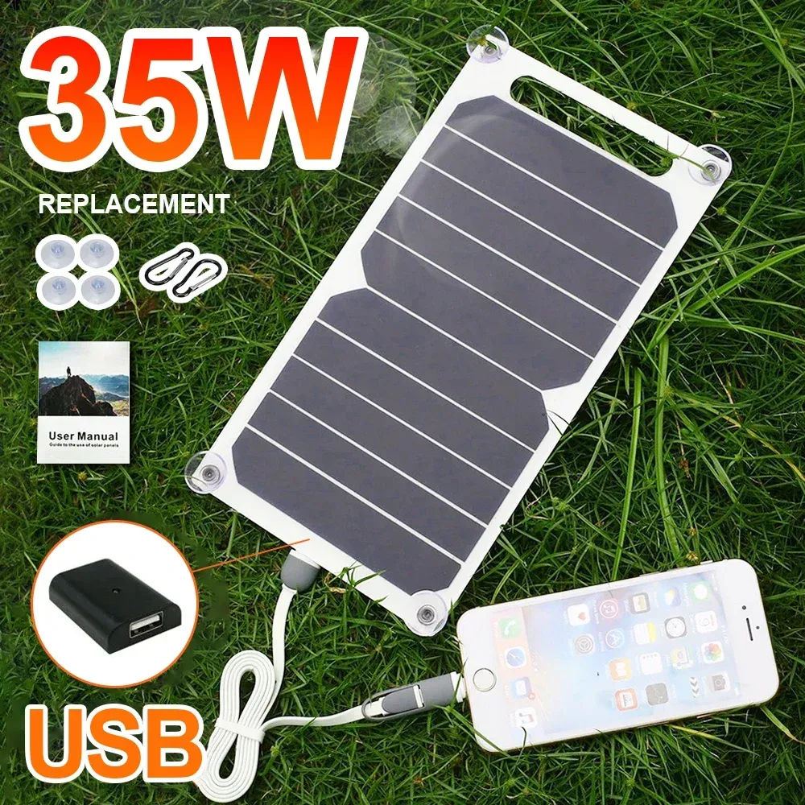
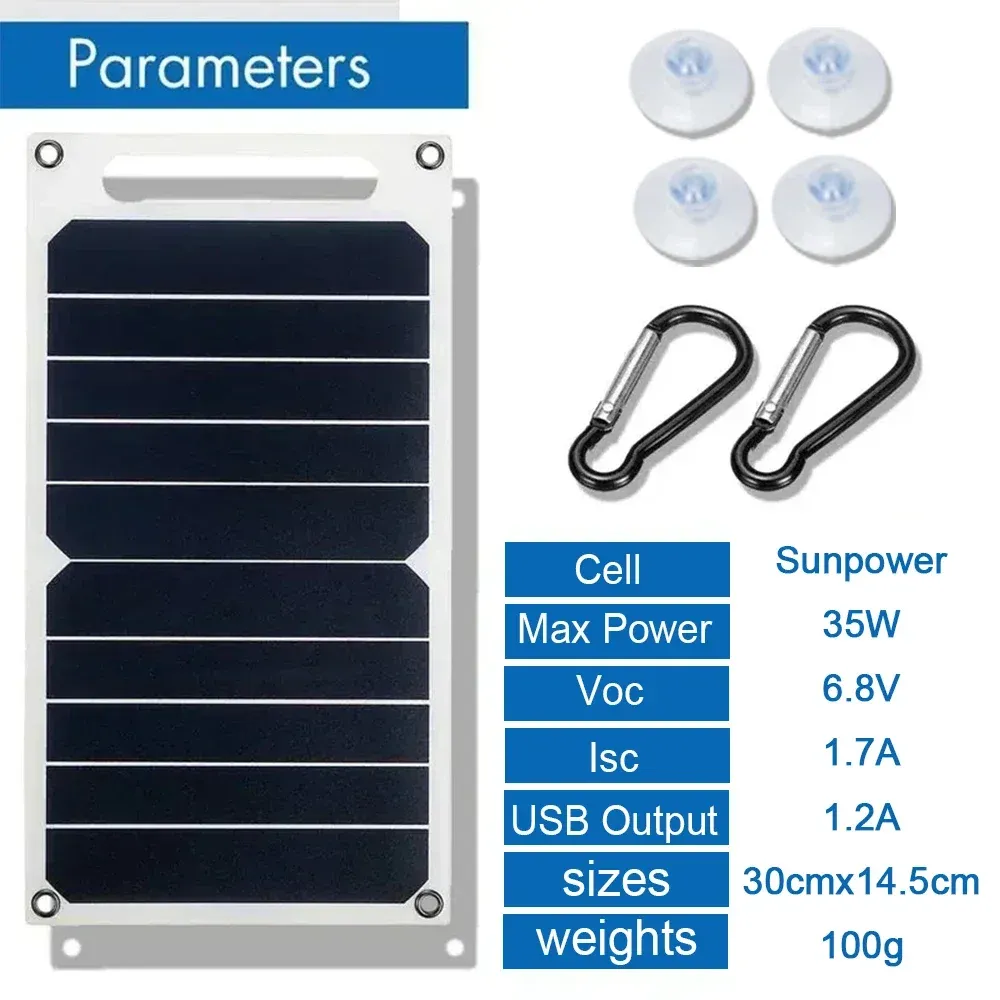
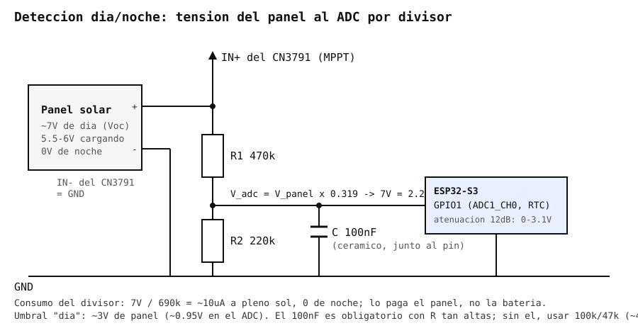

# Panel solar "35W Sunpower 5V USB" (AliExpress)

Ficha de referencia del panel solar previsto para el nodo exterior autónomo
("espantapájaros" / water-tower-defense, ver [`README.md`](../../README.md)):
es la entrada del cargador MPPT [CN3791](cn3791-mppt-charger.md), que carga la
batería 1S de la que cuelgan el [TPS63020](tps63020-buck-boost.md) (3.3V,
lógica) y el [TPS61088](tps61088-boost-converter.md) (5V, servos). Listado
del vendedor:
[es.aliexpress.com/item/1005007701773816.html](https://es.aliexpress.com/item/1005007701773816.html)
(*Panel Solar portátil Sunpower de 35W, placa Solar de 5V con cargador
estabilizador seguro USB*, vendedor Soecopo Store, ~7.4€ en el momento de la
compra citada en el vídeo de abajo).



## Identificación

| | |
| --- | --- |
| Celdas | 2 celdas monocristalinas tipo Sunpower (back-contact, sin busbars visibles) en serie, laminadas en lámina PET blanca semiflexible con 4 ojales |
| Tamaño / peso | 30 × 14.5 cm, ~100 g |
| Salida | Caja negra con **regulador a 5V y puerto USB-A hembra**, cable plano corto |
| Accesorios | 4 ventosas, 2 mosquetones, manual |
| Variantes del listado | Mismo panel vendido también como "15W" y "20W"; el número de vatios del título es puro marketing |

Specs según la tabla "Parameters" del vendedor:



| Parámetro (vendedor) | Valor |
| --- | --- |
| "Max Power" | 35W |
| Voc (circuito abierto) | 6.8V |
| Isc (cortocircuito) | 1.7A |
| Salida USB | 5V / 1.2A |

Solo con las cifras del propio vendedor ya no cuadra: 6.8V × 1.7A = 11.6W como
techo absoluto (Voc × Isc siempre es mayor que la potencia real), muy lejos
de 35W. Y como se ve a continuación, ni siquiera ese Isc es real.

## Cifras reales (vídeo de ea3grn)

Medidas de este mismo listado en el vídeo
[**156 - PANELES SOLARES Y NODOS MESHTASTIC**](https://www.youtube.com/watch?v=nixWEYjBFH8)
(canal ea3grn, mayo 2025), que compara cuatro paneles baratos y explica cómo
dimensionar la alimentación de un nodo solar. Tramos útiles:
[09:08 probando las placas](https://www.youtube.com/watch?v=nixWEYjBFH8&t=548),
[10:58 analizando los datos](https://www.youtube.com/watch?v=nixWEYjBFH8&t=658),
[19:59 cargadores y MPPT](https://www.youtube.com/watch?v=nixWEYjBFH8&t=1199),
[27:48 ¿qué potencia necesito?](https://www.youtube.com/watch?v=nixWEYjBFH8&t=1668).

| Parámetro | Vendedor | Medido (ea3grn) |
| --- | --- | --- |
| Voc | 6.8V | **7.0V** |
| Isc | 1.7A | **0.84A** |
| Potencia | 35W | **5.9W** teórico (Voc × Isc), **~4.7W** utilizable (80%) |
| Corriente útil | — | **~670mA** en el punto de máxima potencia (≈ 0.8 × Isc) |

Qué significan las dos corrientes:

- **Isc, corriente de cortocircuito** (840mA): la que da el panel con los dos
  cables unidos, es decir, a 0V. Es un dato de caracterización, no de
  trabajo — un panel en cortocircuito no entrega potencia (0V × 840mA = 0W).
- **Corriente efectiva** (~672mA): la que entrega en el *punto de máxima
  potencia*, alrededor de 5.6-6V con este panel, que es donde intenta
  mantenerlo un cargador MPPT. Regla de dedo del vídeo: ~80% de Isc.

Para comparar, el mismo vídeo mide un panel de 133×73mm a 7.0V/186mA
(1.26W, 2.2€), una placa de 110×60mm a 6.8V/130mA (0.88W, 2.4€) y una
"10W" de Amazon a 5.9V/630mA (3.7W, 18€): este "35W" es, con diferencia, el
que más vatios reales da por euro.

## Quitar el regulador USB

La caja negra del cable lleva un pequeño convertidor DC-DC a 5V pensado para
enchufar un móvil directamente. Para este proyecto **no sirve**:

- El [CN3791](cn3791-mppt-charger.md) hace MPPT sobre la tensión *bruta* del
  panel: necesita ver los ~7V de Voc y poder mover el punto de trabajo. Si le
  llegan 5V regulados, el rastreo no tiene nada que rastrear y además el
  regulador intermedio se come una parte de los ~4.7W que ya son escasos.
- 5V es una tensión incómoda para cargar 1S: apenas hay margen sobre los 4.2V
  de fin de carga.

Así que se **desmonta la caja USB** (es una pieza de plástico encajada/pegada:
se abre haciendo palanca o se corta el cable antes de ella) y se sacan los dos
hilos del panel directamente a la entrada `IN` del módulo CN3791, como explica
el vídeo en el tramo de
[cargadores y MPPT](https://www.youtube.com/watch?v=nixWEYjBFH8&t=1199).
Antes de soldar nada: **comprobar polaridad con el multímetro al sol** (el
panel a circuito abierto debe marcar ~7V con el rojo en el positivo) y, si
se quiere reutilizar la caja para otra cosa, medir en sus dos cables de
entrada cuál viene del positivo del panel.

## Detección día/noche (medir el panel con el ADC)

El propio panel sirve de sensor de luz: a circuito abierto da ~7V con sol y
0V de noche, sin necesidad de LDR ni de reloj. Se mide la tensión *bruta* en
la entrada `IN` del CN3791 (antes del cargador, después de quitar la caja
USB) con un divisor resistivo al ADC del ESP32-S3.



*Esquema generado con IA; no verificado en banco.*

Qué se ve en ese punto:

| Situación | Tensión en el panel | En el ADC (×0.319) |
| --- | --- | --- |
| Noche | 0V | 0V |
| Amanecer / muy nublado | 1-4V | 0.3-1.3V |
| Día, cargando (MPPT en Vmp) | 5.5-6V | 1.75-1.9V |
| Día, batería llena (MPPT parado, Voc) | ~7V | 2.23V |

Un umbral de **~3V en el panel** (≈0.95V en el ADC), con algo de histéresis
(p. ej. día por encima de 3V, noche por debajo de 2V), separa las dos
situaciones sin ambigüedad.

**Divisor:** R1 = 470k (al `+` del panel), R2 = 220k (a GND), salida en el
nudo → GPIO. Relación 220/(470+220) = 0.319: 7V de panel son 2.23V en el
ADC, con margen hasta los ~3.1V que admite la atenuación de 12dB (aguantaría
hasta ~9.7V de panel).

- **C = 100nF** del nudo a GND, **obligatorio** con resistencias tan altas: el
  ADC del ESP32 carga un condensador interno al muestrear y con una fuente de
  varios cientos de kΩ leería bajo y con ruido; el 100nF actúa de depósito y
  además filtra el rizado que mete el MPPT. Si se prefiere no ponerlo, bajar
  a 100k/47k (misma relación, 0.320) a cambio de más consumo.
- **Consumo del divisor:** 7V / 690k ≈ **10µA a pleno sol, 0 de noche**. Lo
  paga el panel, no la batería, y es la mitad que el propio PIR. Con 100k/47k
  serían ~48µA.
- **Pin:** tiene que ser de **ADC1 (GPIO1-10)**; ADC2 no funciona con el
  WiFi activo. Descontando la cámara (GPIO4-13, 15-18) y el PIR (GPIO14)
  quedan libres **GPIO1, GPIO2 y GPIO3**. Los tres son además pines RTC: si
  algún día se quisiera *despertar* por el panel en vez de por temporizador,
  valdría un wake por nivel (`ext0`), aunque con umbral lógico fijo (~1.5-2V
  en el pin ≈ 5V de panel), menos fino que leer el ADC al despertar.
- Si se pusieran dos paneles en **serie** (Voc ~14V), R1 pasa a 1M.

Esbozo para `huerta.yaml` (**pendiente de añadir**; se lee al despertar, el
ADC no consume nada en deep sleep):

```yaml
sensor:
  - platform: adc
    pin: GPIO1
    id: panel_voltage
    name: "Tensión panel"
    attenuation: 12db
    update_interval: 5s
    filters:
      - multiply: 3.136   # 1 / 0.319 (ajustar con el multímetro)

binary_sensor:
  - platform: analog_threshold
    sensor_id: panel_voltage
    name: "Es de día"
    threshold:
      upper: 3.0
      lower: 2.0
```

## Encaje en el proyecto

- **Corriente de carga:** ~4.7W a ~4V de batería son ~1-1.2A de carga en el
  mejor de los casos a pleno sol, en la práctica ~0.7-0.8A. Cabe de sobra en
  el rango del CN3791 (1-2A): el límite lo pone el panel, no el cargador.
- **Energía diaria orientativa:** con 4-5 horas de sol equivalente, ~20Wh/día;
  con cielo cubierto o mal orientado, una fracción de eso. Es suficiente para
  un nodo con deep sleep y disparos esporádicos de cámara/servos; no lo es
  para tener la cámara en streaming continuo.
- **Mecánica:** 30×14.5cm y 100g, con 4 ojales — fácil de fijar al soporte de
  la torreta o a un poste aparte, orientado al sur e inclinado. Es
  semiflexible, no rígido: hay que apoyarlo sobre algo plano.
- Si hiciera falta más energía, dos paneles en **paralelo** (mismo Voc ~7V,
  suma de corrientes) — el módulo CN3791 tiene el punto MPPT fijado por
  resistencias para paneles de "6V" (~5-6V de trabajo), así que en serie
  (~14V) el rastreo quedaría fuera de sitio salvo que se cambie a la variante
  del módulo para paneles de 12V.

---

*Documento de referencia de hardware, generado a partir de las capturas del
vendedor ([`img/PANEL-35W.webp`](img/PANEL-35W.webp),
[`img/PANEL-35W-params.webp`](img/PANEL-35W-params.webp)) y de las medidas
publicadas por ea3grn en
[youtube.com/watch?v=nixWEYjBFH8](https://www.youtube.com/watch?v=nixWEYjBFH8).
Componente aún no comprado ni cableado en ningún YAML del proyecto; el
divisor al ADC ([`img/panel-divisor-adc.svg`](img/panel-divisor-adc.svg))
tampoco está todavía en `huerta.yaml`.*

*Documento generado con IA; revisar los valores antes de montar.*
