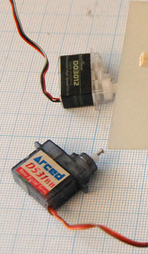
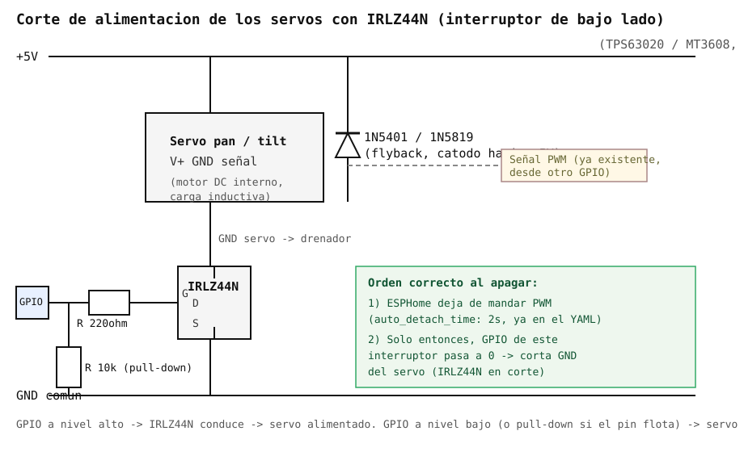

# Servos de la torreta pan/tilt

Ficha de referencia de los dos servos que aparecen en
[`img/servo.png`](img/servo.png) — stock antiguo de otro proyecto, candidatos
a montar la torreta de `esp32-s3-cam-servo.yaml` (ver
[`esp32-s3-cam-board.md`](esp32-s3-cam-board.md)). Ambos están identificados
en [ServoDatabase](https://servodatabase.com/) y descatalogados hace años;
esta ficha recoge sus specs reales y propone alternativas actuales.

## Identificación confirmada

| | Servo superior | Servo inferior |
| --- | --- | --- |
| Modelo | **Blue Arrow D03012** | **Arced D531BB** |
| Ficha | [servodatabase.com/servo/blue-arrow/d03012](https://servodatabase.com/servo/blue-arrow/d03012) | [servodatabase.com/servo/arced/d531bb](https://servodatabase.com/servo/arced/d531bb) |
| Peso | **3.2 g** | **3.9 g** |
| Dimensiones (L×An×Al) | 19.6 × 8.4 × 21.8 mm | 19.0 × 7.9 × 17.5 mm |
| Motor | Coreless | Coreless |
| Engranajes | Plástico | No especificado en la ficha |
| Control | **Digital** | **Digital** |
| Conector | JST-ZH (miniatura, no el JR/Futaba estándar de 2.54mm) | No especificado |
| Torque | 0.30 kg·cm a 4.2V / 0.25 kg·cm a 3.3V | 0.51 kg·cm a 4.8V |
| Velocidad | 0.08s/60° a 4.2V | 0.09s/60° a 4.8V |
| Estado | **Descatalogado** | **Descatalogado** |

Dato relevante que corrige la ficha anterior: **la etiqueta del Arced dice
"Analog Micro Servo", pero ServoDatabase lo cataloga como digital** — es
habitual que el rotulado comercial de estos servos de bazar no sea fiable;
para las specs reales toca fiarse de la base de datos, no de la caja.

Lo más importante para elegir sustituto: **ambos son servos "pico"**, mucho
más pequeños y ligeros que un micro servo estándar tipo SG90/MG90S (que
pesan ~9g y miden ~23×12×29mm). El conector JST-ZH tampoco es el estándar de
3 pines a 2.54mm que llevan la mayoría de servos RC — al montar alternativas
modernas con conector JR/Futaba estándar, hay que adaptar el cableado en la
placa (ver pines usados en `esp32-s3-cam-servo.yaml`, que solo necesitan
señal + alimentación + GND por PWM, sin depender del tipo de conector físico).

## ¿Las alternativas recomendadas antes tienen las mismas medidas/peso?

**No.** SG90, MG90S y DS3218/DS3225 (las recomendadas en la versión anterior
de este documento) son de una categoría de tamaño distinta:

| Servo | Peso | Dimensiones (L×An×Al) | Categoría |
| --- | --- | --- | --- |
| Blue Arrow D03012 (original) | 3.2 g | 19.6 × 8.4 × 21.8 mm | Pico |
| Arced D531BB (original) | 3.9 g | 19.0 × 7.9 × 17.5 mm | Pico |
| EMAX ES9251 II | 2.5 g | 18.0 × 7.9 × 16.8 mm | Pico |
| GH-S37D / GH-S43D (genéricos) | 3.7 / 4.3 g | 20 × 8.75 × 22 mm (con eje) | Pico |
| EMAX ES9051 II | 4.8 g | 19.9 × 8.8 × 23.1 mm | Pico |
| SG90 / MG90S | ~9 g | ~23 × 12.2 × 29 mm | Micro estándar |
| DS3218MG / DS3225MG | ~60 g | ~40 × 20 × 40 mm | Estándar de alto par |

Es decir, SG90/MG90S pesan **el triple** y son notablemente más grandes; las
DS32xx son directamente otra clase de servo (para la torreta final con
pistola de agua, donde el par importa más que el tamaño). Si lo que se busca
es un **reemplazo del mismo tamaño/peso** que el D03012/D531BB originales
(por ejemplo, para no rediseñar el soporte mecánico existente), hacen falta
servos "pico", no micro estándar:

### Reemplazos del mismo tamaño/peso (pico, ~3-6g)

- **EMAX ES9251 II** — 2.5g, 18.0×7.9×16.8mm, digital, coreless (motor de
  6mm), engranajes de plástico, 0.27kg·cm de par a 4.8V, 0.08s/60°, 4.5-6.0V.
  Es el que más se parece en huella al **Arced D531BB** (misma anchura, 1mm
  menos de largo y de alto) y admite 5V fijos; a cambio tiene la mitad de par.
  Disponible en AliExpress:
  [listado 1](https://de.aliexpress.com/i/4001299437053.html),
  [listado 2](https://www.aliexpress.com/i/32912752556.html).
  [Ficha EMAX](https://emaxmodel.com/products/emax-es9251-ii-4g-plastic-micro-digital-servo-for-rc-model).
- **GH-S37D** (genérico de 3.7g, decenas de vendedores) — 3.7g, 20×8.75×22mm
  (alto con eje), digital, coreless, engranajes de plástico, 0.6-0.8kg·cm de
  par, 0.09s/60°. Es el clon directo de la clase del Arced/Blue Arrow: misma
  carcasa (~20×8mm de base) y peso. AliExpress:
  [búsqueda "3.7g servo"](https://www.aliexpress.com/w/wholesale-3.7g-servo.html),
  [pack 5-20 uds GH-S37D/GH-S43D](https://www.aliexpress.us/item/3256803081306558.html),
  [TK-SO37 coreless 180°](https://www.aliexpress.com/item/1005009523664399.html).
  [Specs](https://manuals.plus/m/9b2b34bfe98b3ce26d84e25f306007f719a5e8b81fafc7f0f377225097acad6f).
- **GH-S43D** — 4.3g, 20.5×8.6×22.7mm, igual que el S37D con algo más de par
  (0.8kg·cm) y 0.10s/60°; se vende en los mismos listados.
  [Specs](https://www.laskakit.cz/en/plastove-digitalni-micro-servo-gh-s43d-4-3g--180--/).
- **EMAX ES9051 II** — 4.8g, 19.9×8.8×23.1mm, digital, coreless, engranajes
  de plástico, 3.6-6.0V, 0.85kgf·cm de par y 0.07s/60° a 4.8V (1.0kgf·cm y
  0.06s/60° a 6V), conector FUT/JR estándar (según datasheet EMAX 2018/11/6).
  Es prácticamente el mismo tamaño y peso que el D03012 original, y se compra
  hoy sin problema (Amazon, tiendas de aeromodelismo,
  [AliExpress 4 uds](https://www.aliexpress.us/item/3256804176360888.html)).
  [Ficha](https://servodatabase.com/servo/e-max/es9051).

Estos sí son sustitutos "drop-in" en tamaño y peso del D03012/D531BB
originales, con la ventaja de ser piezas actuales y no descatalogadas.

## Compatibilidad de tensión: los alimenta el TPS61088 a 5V fijo

En este proyecto los servos no cuelgan de una pila suelta ni del riel de la
placa: tienen su propio regulador, un [TPS61088](tps61088-boost-converter.md)
fijado a **5V**, separado del [TPS63020](tps63020-buck-boost.md) que da
3.3V a la ESP32-S3-CAM (con `GND` común entre ambos). El plan original era
usar los Arced D531BB directamente a 1S (3.0-4.2V), pero al pasar a
**MG90S** hace falta un riel de 5V real: los MG90S son servos de 4.8-6V, no
de 3.3V. Eso fija la tensión de los servos en 5V constantes, y ahí el D03012
original tiene un problema:

| Servo | Tensión máxima según ficha | ¿Vale a 5V fijos? |
| --- | --- | --- |
| Blue Arrow D03012 (original) | **4.2V** | **No** — 5V lo sobrepasa casi un 20%, fuera de su rango documentado (3.3-4.2V) |
| Arced D531BB (original) | Caracterizado a 4.8V (máximo no confirmado en la ficha) | Dudoso — 5V está justo por encima del único valor documentado |
| EMAX ES9251 II | 4.5-6.0V | Sí |
| EMAX ES9051 II | 3.6-6.0V | Sí, con margen |
| MG90S | 4.8-6.0V | Sí |
| DS3218MG | 4.8-6.8V (variante "Pro": 5.0-6.8V) | Sí |

Es decir: en un riel de 5V fijos el **D03012 original no es apto** (quedaría
sobrealimentado de forma permanente, no solo en un pico), y el D531BB es
cuando menos incierto — ambos quedan descartados. Todas las alternativas
modernas listadas arriba (ES9251 II, ES9051 II, MG90S, DS3218MG) sí admiten 5V
dentro de su rango normal. El módulo TPS61088 ofrece también 9V y 12V, pero
ninguno de estos servos los admite (MG90S máx 6V, DS3218MG máx 6.8V), así
que 5V es la única opción válida.

### Si en cambio se prefiere subir de categoría (más robustez, menos precisión de tamaño)

Sigue siendo válido lo recomendado antes, pero asumiendo que implica rehacer
el soporte mecánico porque el tamaño no es compatible:

- **MG90S** — micro servo digital estándar (~9g), engranajes metálicos, el
  más común y documentado hoy; solo tiene sentido si de todos modos se va a
  ajustar/imprimir un soporte nuevo. **Es el servo elegido** para la torreta
  y el que dimensiona el riel del [TPS61088](tps61088-boost-converter.md).
- **DS3218MG / DS3225MG** — para la torreta final a la intemperie con la
  pistola de agua (ver README, "water-tower-defense"), donde el par y la
  resistencia a salpicaduras pesan más que mantener el tamaño original.

## El pico de consumo real: por qué los servos no comparten regulador con la cámara

**Decisión tomada:** los servos van en un riel de 5V propio con un
[TPS61088](tps61088-boost-converter.md); la ESP32-S3-CAM va a 3.3V con el
[TPS63020](tps63020-buck-boost.md). Lo que sigue es el análisis que llevó a
esa separación, referido a la idea inicial de colgar todo del TPS63020 a 5V.

Más allá de la tensión, el problema serio es de **corriente instantánea**. El
datasheet del [TPS63020](tps63020-buck-boost.md) promete 2A en modo boost,
pero en la práctica (ver el detalle con caso real citado en esa ficha) un
usuario que también boosteaba desde 1S Li-ion solo consiguió sostener
**~1.9A con la batería a 3.0V**, y pasado ese punto la tensión de salida
empieza a hundirse en vez de cortar limpiamente — así que el límite
**utilizable con margen real es más bien ~1.5A**, no los 2A de la etiqueta.
Ese presupuesto (más estrecho de lo que parece) tiene que cubrir a la vez la
ESP32-S3-CAM (picos de transmisión Wi-Fi y captura de cámara) **y** los dos
servos moviéndose o forzando contra un tope mecánico — el caso normal de un
seguimiento proporcional continuo (`detect/servo_tracker.py`), no una
rareza.

Corriente de **parada forzada (stall)** por servo — el pico que hay que
presupuestar, no la corriente en movimiento libre:

| Servo | Corriente de stall (aprox.) | 2 servos a la vez |
| --- | --- | --- |
| **Arced D531BB** (pico) | **~210mA medidos** forzándolo contra un tope (medición propia, sin dato oficial) | ~0.4 A |
| Blue Arrow D03012 (pico, sin dato oficial) | No publicada; previsiblemente del orden del D531BB | ~0.4-0.6 A |
| EMAX ES9051 II / ES9251 II / GH-S37D (pico modernos) | No publicada; comparable a la clase anterior, ~200-500mA | ~0.4-1.0 A |
| **MG90S** | **~700-900mA medidos**, según reportes de usuarios en foros de Arduino/RC ([fuente 1](https://www.kpower.com/insight_bldc/7870.html/), [fuente 2](https://forum.arduino.cc/t/how-to-power-mg90s-motors-and-arduino-nano/1001853)); en movimiento normal (no forzado) ronda 120-250mA | **~1.4-1.8 A** |
| **DS3218MG** | **~2.1A a 5V** (hasta 2.9A a 6.8V, según datasheet DSSERVO) | **~4.2 A** |

A eso hay que sumarle el consumo de la propia placa: la ESP32-S3 puede dar
picos de varios cientos de mA en la entrada de 5V durante una transmisión
Wi-Fi o una captura de cámara.

**Conclusión práctica:**

- Con los servos **pico** originales o sus reemplazos modernos (ES9051 II,
  ES9251 II, GH-S37D), el pico combinado (servos + placa) se queda razonablemente por
  debajo del límite real de ~1.5A — es la opción más segura para compartir
  el mismo regulador que la cámara.
- Con **MG90S**, el consenso de la comunidad Arduino/RC es tajante: usar
  **una fuente separada para los servos** y no colgarlos del mismo riel que
  la lógica, precisamente porque la caída de tensión bajo carga causa
  comportamiento errático (brownouts). Con dos MG90S parados a la vez
  (~1.4-1.8A) ya se come casi todo el presupuesto real del TPS63020, dejando
  la ESP32-S3-CAM sin margen para sus propios picos — mejor no compartir
  el mismo módulo con este servo tampoco, aunque el datasheet en teoría lo
  permitiera.
- Con **DS3218MG/DS3225MG** (recomendados para la torreta final con pistola
  de agua), **dos servos parados a la vez ya superan solos el límite del
  módulo** (~4.2A frente a ~1.5A reales) — descartado compartir el
  TPS63020 con estos servos bajo cualquier escenario.
- **Recomendación general, validada tanto por el caso real del TPS63020 como
  por la experiencia de la comunidad con el MG90S:** alimentar los servos
  (cualquiera que no sea de clase pico) desde una etapa de potencia aparte,
  no desde el mismo riel de 5V que la ESP32-S3-CAM, con GND común entre
  ambas fuentes. Añadir un condensador electrolítico de valor alto
  (1000-2200µF) cerca de los servos ayuda a amortiguar picos cortos, pero no
  sustituye a dimensionar la fuente para la corriente de stall real.

## Consumo si no se corta la alimentación durante el deep sleep

Las cifras de arriba son el pico de stall — lo que hay que presupuestar para
la fuente. Pero para decidir si merece la pena cortar la alimentación de los
servos en deep sleep (ver sección siguiente), importa otro número distinto:
cuánto consumen los servos **en reposo, con alimentación puesta pero sin
moverse**.

| Servo | Idle/reposo según fabricante (banco, sin carga) |
| --- | --- |
| **MG90S** | ~5-6mA con la electrónica en reposo sin corregir posición; sube a ~70-90mA en cuanto corrige activamente sin carga externa ([fuente](https://www.kpower.com/insight_bldc/7870.html/)) |
| **DS3218MG / DS3225MG** | ~4-5mA "detenido" (idle), según datasheet DSSERVO, medido en banco sin carga externa |
| Blue Arrow D03012 / Arced D531BB, EMAX ES9051 II / ES9251 II, GH-S37D | Sin cifra de idle publicada por el fabricante; sub-micro/pico de clase similar a otros analógicos de 9g, previsiblemente entre unas pocas mA y unas pocas decenas de mA en reposo sin carga |

**El matiz importante:** esa cifra de datasheet es de banco, sin carga
externa — no es lo que va a consumir el servo sujetando de verdad el peso de
la torreta (cámara y mecanismo, y en la variante pesada también la pistola
de agua) contra la gravedad. Si el conjunto no está bien equilibrado, el
motor tiene que corregir de forma continua para no ceder, y el consumo real
de "reposo con alimentación puesta" puede acercarse al rango de movimiento
normal ya documentado arriba (120-250mA en el caso del MG90S) en vez de
quedarse en los pocos mA del datasheet — depende del equilibrio mecánico de
la torreta, no solo del servo.

**Impacto en la autonomía si no se corta la alimentación:** incluso en el
mejor caso (servos bien equilibrados, consumo cercano al idle de datasheet),
dos servos sin cortar suponen del orden de **8-10mA continuos** solo por
estar encendidos — y si tienen que corregir contra el peso de la torreta,
eso puede subir con facilidad a **decenas o unos pocos cientos de mA**. Comparado
con el consumo de deep sleep de una ESP32 (decenas de µA), la diferencia es
de **3-4 órdenes de magnitud**: dejar los servos alimentados domina por
completo el consumo del nodo durante el sueño, sin importar cuánto se
optimice el resto del circuito (incluido el propio regulador boost, ver
[`xl6009-boost-converter.md`](xl6009-boost-converter.md#rol-previsto-xl6009-como-riel-de-servos-cortado-por-un-irlz44n)).
Es la justificación práctica de cortar la alimentación de los servos en vez
de solo despertar/dormir el regulador.

## Cortar la alimentación de los servos (ahorro en reposo)

Además de separar el riel, se corta del todo la corriente a los servos
cuando no hay seguimiento activo. Con el [TPS61088](tps61088-boost-converter.md)
elegido esto se hace **por su pin `EN`** desde un GPIO del ESP32-S3, sin
ningún componente extra: con `EN` bajo el regulador queda en 1-3µA y los
servos sin tensión.

El esquema con **IRLZ44N** que sigue (el mismo MOSFET usado para el motor de
la [pistola de agua](bambulab-zc005-water-gun.md), como interruptor de bajo
lado en el retorno a GND del servo) queda como **respaldo** por si el módulo
TPS61088 que llegue no expone `EN` en un pad accesible. Las precauciones de
orden de apagado del final de esta sección aplican igual en ambos casos.

Puntos clave del esquema:

- **Diodo flyback** entre V+ y GND del servo (mismo criterio que en el
  motor de la pistola: dentro del servo hay un motor DC, sigue siendo carga
  inductiva).
- **Resistencia de gate** (~220Ω) entre el GPIO y la puerta del MOSFET, y
  **pull-down** (~10kΩ) de la puerta a GND — el pull-down es lo que evita
  que el servo reciba corriente sin querer si el GPIO queda flotando durante
  el arranque del ESP32.
- **Orden de apagado importante** (vale igual para el `EN` del TPS61088):
  primero dejar que ESPHome corte la señal PWM (`auto_detach_time: 2s`, ya
  presente en `esp32-s3-cam-servo.yaml`), y solo después bajar el GPIO de
  corte. Cortar la alimentación mientras el pin de señal todavía manda PWM
  puede alimentar el servo a medias a través de sus diodos de protección
  internos.

También disponible como esquema editable de KiCad: abre
[`diagrams/mosfet-load-switch/mosfet-load-switch.kicad_pro`](diagrams/mosfet-load-switch/mosfet-load-switch.kicad_pro)
(el proyecto va en su propia carpeta, con `.kicad_pro`/`.kicad_sch`/`.kicad_pcb`
a juego, que es como KiCad espera encontrarlo) — con símbolos propios (R,
diodo, MOSFET, carga) definidos dentro del propio archivo, sin depender de
ninguna librería oficial de KiCad. Verificado con `kicad-cli` (exporta a PDF
sin errores y con las conexiones correctas).

Se intentó primero como archivo de Fritzing (`fritzing/mosfet-load-switch.fz`,
sigue en el repo) y como diagrama de draw.io, pero se descartaron: Fritzing
por su formato interno propenso a errores de parseo, y draw.io porque el
layout automático quedaba con cables cruzados y sin símbolos eléctricos
reales.

## Qué necesita el proyecto a nivel de firmware

En `esp32-s3-cam-servo.yaml` los servos se controlan por PWM estándar a
50Hz vía el componente `servo:` de ESPHome (pulso ~1-2ms, rango -1.0..1.0
mapeado por `servo.write`) — **cualquiera de las opciones de arriba sirve
igual a nivel de firmware**, es una cuestión puramente mecánica (tamaño del
soporte, tipo de conector) y de la fuente de alimentación (ver más abajo).

## Notas de integración

- El YAML ya avisa (comentario "OJO CON EL TIMER LEDC") de que los servos van
  en los canales LEDC 4 y 6 para no chocar con el reloj de la cámara — eso no
  cambia con ningún sustituto.
- Los originales (D03012/D531BB) usan conector JST-ZH; los reemplazos "pico"
  como el ES9051 suelen traer conector JR estándar de 2.54mm — revisar el
  cableado del pin de señal al montar cualquiera de las dos opciones.
- Si se pasa a un servo de mayor par (DS3218/DS3225), revisar la
  alimentación: tiran de más corriente en el arranque/parada (~2.1A de stall
  cada uno), pero siguen cabiendo en el riel del
  [TPS61088](tps61088-boost-converter.md) a 5V — solo hay que revisar que la
  batería aguante la corriente de entrada correspondiente.

---

*Documento de referencia de hardware, generado a partir de la foto
[`img/servo.png`](img/servo.png) y las fichas de
[Blue Arrow D03012](https://servodatabase.com/servo/blue-arrow/d03012) y
[Arced D531BB](https://servodatabase.com/servo/arced/d531bb) en
ServoDatabase. Ninguno de los servos mencionados está montado todavía en un
YAML activo.*
