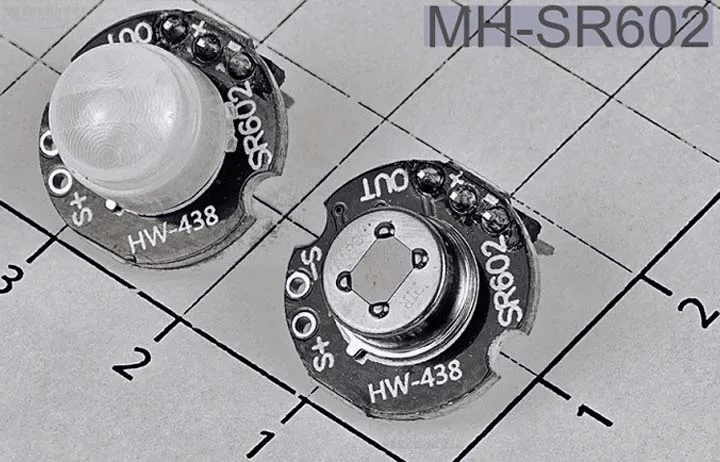
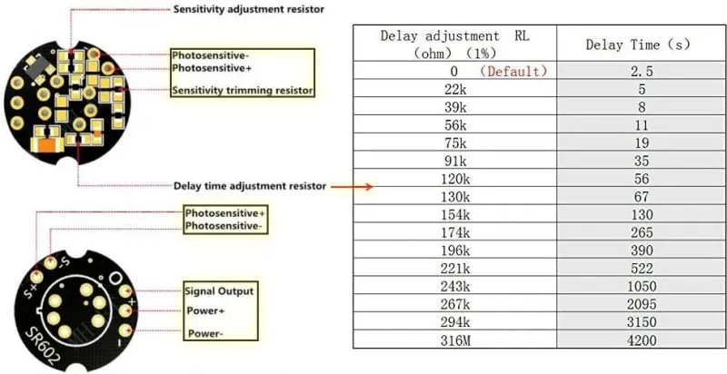
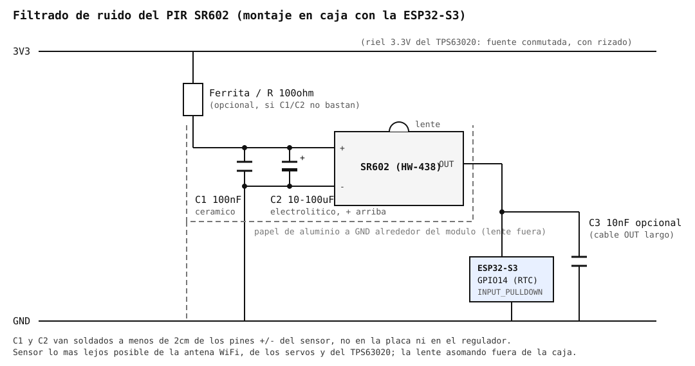

# Sensor PIR mini SR602 (MH-SR602 / HW-438)

Ficha de referencia del sensor de movimiento PIR que despierta al nodo exterior
del deep sleep: es el "PIR Motion" de `huerta.yaml` (GPIO14) y el mismo que
usará la variante "espantapájaros" / water-tower-defense (ver
[`README.md`](../../README.md)). Frente al clásico HC-SR501, es diminuto, va a
3.3V sin regulador intermedio y consume ~20µA, que es lo que importa en un nodo
a batería alimentado por el [TPS63020](tps63020-buck-boost.md).

## Identificación

| | |
| --- | --- |
| Nombre comercial | SR602 / MH-SR602 / HC-SR602 "Mini PIR"; PCB serigrafiado **HW-438** |
| Tamaño | PCB redondo de ~10mm de diámetro, lente de Fresnel blanca de ~10mm, ~12mm de alto total |
| Pines | 3 pines a 2.54mm en un lateral: `-` (GND), `+` (Vin), `OUT`. Dos pads sueltos `S+`/`S-` para una fotorresistencia/fotodiodo opcional (ver abajo) |
| Elemento PIR | Sensor piroeléctrico digital de 6 pines sin marcar (misma familia que BM612 / AS612): toda la lógica de detección va dentro del propio sensor, el PCB solo lleva las resistencias de ajuste |

## Specs clave

| Parámetro | Valor |
| --- | --- |
| Alimentación | **3.3-15V DC** (límites absolutos 2.8-18V) |
| Consumo en reposo | **~20µA** |
| Salida `OUT` | Nivel lógico **3.3V** en alto, 0V en bajo, independientemente de Vin (lo fija el sensor, no hay divisor) |
| Tiempo en alto tras detección | **2.5s** de fábrica; ajustable de 2.5s a ~1h cambiando una resistencia SMD (tabla más abajo) |
| Tiempo de bloqueo tras cada disparo | 2s, no ajustable |
| Modo de disparo | **Retriggerable**: mientras haya movimiento sigue en alto; no se puede cambiar a disparo único |
| Alcance | Hasta ~5m; recomendado 0-3.5m |
| Ángulo | ~100° (lente estándar de estos módulos; no lo publica el fabricante) |
| Arranque | Al dar tensión saca **`OUT` en alto ~2s** y necesita unos segundos más para estabilizarse — hay que ignorar el primer pulso tras encender |

## Ajustes por resistencia SMD (no hay potenciómetros)

Al contrario que el HC-SR501, no hay trimpots: la sensibilidad y el retardo
van fijados por resistencias SMD (0603) en la cara del sensor. El pad de
retardo (`RL`) está vacío de fábrica (= 2.5s); soldar una resistencia lo
alarga:

| RL | Retardo | RL | Retardo |
| --- | --- | --- | --- |
| 0 / vacío | 2.5s (fábrica) | 130k | 67s |
| 22k | 5s | 154k | 130s |
| 39k | 8s | 196k | 390s |
| 56k | 11s | 221k | 522s |
| 75k | 19s | 243k | 1050s |
| 91k | 35s | 267k | 2095s |
| 120k | 56s | 316k | 4200s |

**Para este proyecto no hace falta tocarlo**: el retardo de 2.5s solo tiene
que ser lo bastante largo para despertar el ESP32-S3 (el flanco ya basta), y
el tiempo que el nodo se mantiene despierto lo gobierna el propio firmware
(temporizador de inactividad en `huerta.yaml`, con `delayed_off: 2s` en el
`binary_sensor`), no el sensor.

Los pads `S+`/`S-` admiten un fotodiodo/LDR para que el sensor solo dispare de
noche; sin nada soldado funciona las 24h, que es lo que se quiere aquí (los
pájaros vienen de día).

## Rol en el proyecto

- `huerta.yaml` lo lee en **GPIO14** y usa ese mismo pin como `wakeup_pin` del
  `deep_sleep` (`wakeup_pin_mode: IGNORE`, para que un PIR todavía en alto no
  bloquee la entrada en sueño). En `on_boot` el pin se fuerza a
  `INPUT_PULLDOWN` para que no flote mientras el sensor arranca.
- GPIO14 es un pin RTC del ESP32-S3, requisito para despertar por GPIO desde
  deep sleep: si se cambia de pin, tiene que ser otro pin RTC (GPIO0-21).
- Alimentación directa al riel de **3.3V** del TPS63020 (mismo riel que la
  placa), nada de 5V: la salida es 3.3V lógicos en cualquier caso, pero así
  el consumo total del sensor queda en los ~20µA que anuncia. Con el nodo
  dormido, el PIR es de lo poco que queda encendido: 20µA sobre una 18650
  de 2600mAh son ~15 años, es decir, irrelevante frente al resto.
- `esp32-s3-cam-servo.yaml` (torreta USB) **no** lleva PIR.

## Filtrado de ruido y montaje en caja

Montado suelto en el banco el SR602 va bien; metido en la misma caja que la
ESP32-S3 empieza a disparar solo. No es un defecto del sensor: al no tener
trimpot de ganancia y llevar toda la detección dentro del elemento
piroeléctrico, amplifica cualquier cosa que le entre por la alimentación o
por el aire. En la caja concurren tres fuentes de ruido:

1. **Rizado de la alimentación**: el riel de 3.3V sale de un conmutado
   ([TPS63020](tps63020-buck-boost.md)), y encima cae cada vez que el WiFi
   transmite o un servo arranca. El sensor consume 20µA, pero lo que le
   molesta es la *variación* de tensión, no la corriente.
2. **RF del WiFi**: la antena de la ESP32-S3 a pocos centímetros del elemento
   PIR. Es la causa más citada de falsos positivos de PIR con ESP.
3. **Calor interno**: regulador, cámara y servos calientan el aire de la
   caja; una corriente de aire caliente delante de la lente es, para el PIR,
   un cuerpo moviéndose.

*Esquema generado con IA; no verificado en banco.*

Receta, en orden de menos a más trabajo (parar cuando deje de fallar):

1. **C1 = 100nF cerámico + C2 = 10-100µF electrolítico** en paralelo entre
   `+` y `-`, **soldados a los propios pines del sensor** (a menos de ~2cm);
   en la placa o en la salida del regulador no sirven. C1 mata el ruido de
   alta frecuencia (conmutación, RF), C2 tapa las caídas lentas (WiFi,
   servos). Polaridad de C2: `+` hacia el pin `+`.
2. **Ferrita o R de 100Ω en serie** en el `+` antes de C1/C2 (filtro RC/LC).
   Con 20µA de consumo la caída en 100Ω son 2mV, despreciable.
3. **Lente fuera de la caja y módulo apartado**: lo más lejos posible de la
   antena WiFi, del TPS63020 y de los servos; que la lente asome por un
   agujero en vez de mirar a través de plástico.
4. **Apantallar**: papel de aluminio (o cinta de cobre) alrededor del módulo
   y de C1/C2, conectado a GND, dejando libre la lente. Es lo que más gente
   reporta como remedio definitivo contra la RF del WiFi.
5. **C3 = 10nF de `OUT` a GND** solo si el cable hasta GPIO14 es largo
   (>20-30cm) y va cerca de los servos; el `INPUT_PULLDOWN` sigue.
6. **Software**: además del `delayed_off: 2s`, exigir dos flancos en pocos
   segundos antes de dar por válida la detección (contador + ventana) es lo
   que se usa en ESPHome cuando el hardware no llega del todo. Con el nodo
   en deep sleep esto cuesta un despertar extra por falso positivo, así que
   conviene resolverlo antes en hardware.

## Notas de integración

- **Falsos disparos al aire libre:** el SR602 es más nervioso que el
  HC-SR501 (ganancia fija, sin trimpot). Le afectan el sol directo sobre la
  lente, el viento moviendo hojas calientes y el propio calor de la
  placa/servos si queda pegado a ellos. Montarlo a la sombra, mirando hacia
  la zona a vigilar y apartado de la electrónica; el `delayed_off` y el
  temporizador del firmware ya filtran pulsos sueltos. Para el ruido
  eléctrico dentro de la caja, ver el apartado anterior.
- **Cables largos:** la salida es débil (unos pocos mA); con más de ~20-30cm
  hasta la placa conviene mantener el pull-down y evitar pasar el cable junto
  al de los servos.
- **Alcance real de 3-5m**: suficiente para cubrir el bancal, no para "ver"
  un pájaro a 10m. Si hiciera falta más alcance, un HC-SR501 (hasta 7m,
  ajustable) a cambio de ~50µA-1.5mA y 5V mínimos en la mayoría de módulos.
- Al soldar el header, el sensor queda perpendicular al PCB: elegir la
  orientación de los pines según cómo vaya a ir la lente.

---

*Documento de referencia de hardware, generado a partir de la
[guía de Codrey Electronics](https://www.codrey.com/electronics/mh-sr602-pir-motion-sensor-guide/)
(fotos en [`img/SR602.webp`](img/SR602.webp) y
[`img/SR602-ajustes.webp`](img/SR602-ajustes.webp)), la
[hoja de producto](https://rxtx.su/files/datasheets/electronic-components/sensors/motion-sensors/hc-sr602.pdf)
y la [ficha de Sinoning](https://www.sinoning.com/hc-sr602-datasheet/).
Filtrado de ruido a partir de experiencias en
[MySensors (PIR false positives)](https://forum.mysensors.org/topic/7913/pir-sensor-and-false-positives),
[MySensors (triggering on its own)](https://forum.mysensors.org/topic/3287/motion-sensor-triggering-on-its-own),
[Home Assistant Community (ESP32 PIR false positive)](https://community.home-assistant.io/t/esp32-pir-false-positiv/869654),
[OpenMQTTGateway (WiFi interference HC-SR501)](https://community.openmqttgateway.com/t/wifi-interference-with-hc-sr501/2303)
y [esp8266.com](https://www.esp8266.com/viewtopic.php?f=32&t=19952).
Cableado en `huerta.yaml` (GPIO14).*

*Documento generado con IA; revisar los valores antes de montar.*
