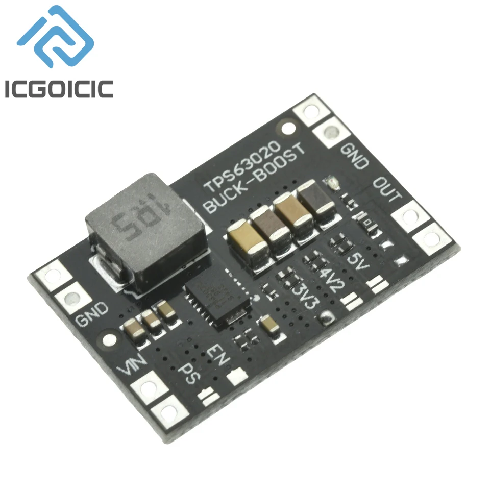

# Módulo regulador buck-boost TPS63020

Ficha de referencia del módulo regulador pensado para el nodo exterior a
batería + panel solar ("espantapájaros" / water-tower-defense, ver
[`README.md`](../../README.md)). Igual que el [CN3791](cn3791-mppt-charger.md),
todavía no está cableado en ningún YAML del proyecto. Imagen original en
[`img/TPS63020.webp`](img/TPS63020.webp) (ficha del vendedor ICGOICIC, sin
URL propia guardada).

## Identificación

- **Chip principal:** **TPS63020** (Texas Instruments) — convertidor
  **buck-boost** de alta eficiencia con un único inductor: regula la salida
  tanto si la entrada está por encima como por debajo de la tensión de
  salida objetivo.
- **Corriente de salida:** hasta **2A en modo boost** (cuando la entrada
  está por debajo de la salida) y hasta 4A en modo buck puro, según el
  [datasheet de TI](https://www.ti.com/lit/ds/symlink/tps63020.pdf).
  Ese 2A es el techo del chip en condiciones ideales, no una cifra
  garantizada por cualquier placa genérica que lo monte con una bobina más
  pequeña — no dar por hecho que un módulo barato de AliExpress alcanza el
  máximo del datasheet.
- **Función en el proyecto:** convertir la tensión variable de una batería
  Li-ion 1S (3.0-4.2V, según carga y estado, ya sea directa o vía el
  [CN3791](cn3791-mppt-charger.md)) en **3.3V fijos** que entran
  directamente por el pin `3V3` de la placa ESP32-S3-CAM, saltándose el
  AMS1117-3.3 de a bordo. Con esa salida el módulo trabaja en su rango
  ideal: la mayor parte de la descarga de la celda (4.2→3.3V) está en modo
  buck (límite 4A), y solo entra en boost (límite 2A) por debajo de ~3.3V de
  batería. Puenteado a 5V, en cambio, estaría siempre en boost.

## Cuánto da en la práctica (no solo en el datasheet)

El propio [foro E2E de TI](https://e2e.ti.com/support/power-management-group/power-management/f/power-management-forum/441028/tps63020-maximum-output-current)
tiene un caso de uso real muy parecido al de este proyecto: alguien
alimentando una carga a ráfagas de 2A (un amplificador GSM) desde una **Li-ion
1S**, igual que aquí. Lo que reportó:

- Con la batería a **3.0V** (célula casi descargada, el peor caso real de un
  nodo solar tras la noche), el máximo que consiguió sostener fueron
  **~1.9A** — ya por debajo del "2A" de la hoja de datos.
- Al pedir 2.0A la tensión de salida empezó a caer, y a 2.1A ya colapsaba
  más — es decir, pasado ese punto no hay un corte limpio, sino un
  **sag** (la tensión se hunde) que puede resetear la ESP32-S3 antes de que
  salte ninguna protección.
- Esto es con **3 módulos distintos** probados, así que no es un caso
  aislado de una placa defectuosa concreta.

Conclusión práctica: el "2A" del datasheet es optimista en modo boost desde
1S con la célula descargada. Para presupuestar con margen real, mejor tratar
el límite utilizable como **~1.5A** en ese tramo — y tener en cuenta que baja
más todavía cuanto más descargada esté la batería (justo cuando el panel
solar lleva más tiempo sin cargarla).

Con la salida a **3.3V** este límite solo aplica en el tramo final de la
descarga (batería por debajo de ~3.3V); por encima el módulo está en buck y
tiene mucho más margen. Y como la única carga de este riel es la placa
ESP32-S3-CAM (picos de ~0.5A en transmisión Wi-Fi o captura de cámara), el
presupuesto sobra incluso en el peor caso — los servos no cuelgan de aquí
(ver más abajo).

## Conectores y pines del módulo

| Pin       | Función                                                                 |
| --------- | ------------------------------------------------------------------------- |
| `VIN`     | Entrada de alimentación (batería)                                         |
| `GND` (entrada) | Masa de entrada                                                      |
| `EN`      | Habilitación del regulador (activo, normalmente a nivel alto para encender) |
| `PS`      | Selección de modo **Power Save** (ahorro de energía a cargas ligeras) vs. modo PWM forzado |
| `OUT`     | Salida regulada                                                            |
| `GND` (salida) | Masa de salida                                                        |

La tensión de salida se fija por **puente de soldadura** entre las almohadillas
serigrafiadas `3V3` / `4V2` / `5V` junto al pad `OUT` — hay que puentear la
opción deseada antes de usar el módulo; de fábrica puede no venir puenteado.

## Notas de integración con el proyecto

- Puentear la salida al pad **`3V3`** (no `4V2` ni `5V`) y llevarla al pin
  `3V3` de la placa ESP32-S3-CAM. Según el esquemático del vendedor (ver
  [`esp32-s3-cam-board.md`](esp32-s3-cam-board.md#esquemático)), ese pin es
  el mismo nodo `VCC3.3V` que sale del AMS1117 y del que cuelgan el módulo
  ESP32-S3 y los dos XC6206 (2.8V/1.2V) del sensor de cámara — así que por
  `3V3` queda alimentado todo lo que hace falta a batería. Lo único que queda
  sin tensión es el CH340 (USB-TTL) y el LED WS2812B, que cuelgan de
  `USB_5V`.
- **Por qué saltarse el AMS1117:** es un regulador lineal que necesita
  ≥~4.5V de entrada y disipa en calor toda la diferencia (5V−3.3V)×I.
  Alimentar por `3V3` elimina esa pérdida y el riesgo de que un riel de 5V
  hundido lo deje en dropout y resetee la placa.
- Cadena de alimentación prevista para el nodo autónomo:
  panel solar → `CN3791` (carga MPPT) → batería 1S → `TPS63020` (pad
  `3V3`) → pin `3V3` de la placa ESP32-S3-CAM.
- **Precauciones al alimentar por `3V3`:**
  - No tener conectados a la vez el USB (o el pin `5V`) y este módulo en
    operación normal: el AMS1117 y el TPS63020 quedarían en paralelo sobre
    el mismo nodo de 3.3V. El TPS63020 es un convertidor síncrono y, con
    `PS` en PWM forzado, puede absorber corriente inversa si otra fuente le
    sube la salida por encima de su consigna. Con `PS` en Power Save deja de
    conmutar en ese caso y el riesgo es menor, pero conviene evitarlo igual.
  - Para flashear o ver logs por USB-TTL: llevar `EN` a nivel bajo (o
    desconectar la batería) antes de enchufar el USB.
  - Poner el condensador de salida recomendado por el datasheet lo más cerca
    posible del pin `3V3` de la placa, no solo en el módulo.
- El pin `EN` permite apagar del todo este riel (<1µA) — no implementado
  todavía en ningún YAML.
- `PS` afecta la eficiencia en reposo: en un nodo a batería con deep sleep
  (como `huerta.yaml`) interesa dejarlo en modo Power Save para minimizar el
  consumo en standby, en vez de forzar PWM continuo.
- **Los servos NO cuelgan de este módulo.** Van en su propio riel de 5V con
  un [TPS61088](tps61088-boost-converter.md), con `GND` común con este
  regulador y con la placa. Motivos: los MG90S elegidos en
  [`servos-pan-tilt.md`](servos-pan-tilt.md) necesitan 4.8-6V (no 3.3V), y
  su corriente de stall (~1.4-1.8A con dos a la vez) hundiría el riel de la
  lógica si compartieran regulador. Detalle en
  [`servos-pan-tilt.md`](servos-pan-tilt.md#el-pico-de-consumo-real-por-qué-los-servos-no-comparten-regulador-con-la-cámara)
  y en [`step-up-boost-comparativa.md`](step-up-boost-comparativa.md).
- **El motor de la [pistola de agua ZC005](bambulab-zc005-water-gun.md)
  tampoco cuelga de aquí**: corre de fábrica a 3.7V, así que sale más simple
  alimentarlo directo desde la batería 1S, en paralelo con la entrada `VIN`
  de este mismo `TPS63020`, cortado por su [IRLZ44N](irlz44n-mosfet.md).

---

*Documento de referencia de hardware, generado a partir de la captura del
vendedor en [`img/TPS63020.webp`](img/TPS63020.webp). Componente aún no
cableado en ningún YAML del proyecto.*

*Documento generado con IA; revisar los valores antes de montar.*
